# [小米路由器 3C 刷入 Breed 和 OpenWrt](https://www.cnblogs.com/snoopy1866/p/17278237.html)

本文链接：https://www.cnblogs.com/snoopy1866/p/17278237.html
准备工具：小米路由器3C（R3L）、网线、电脑
准备软件：Xshell、HFS
教程中使用到的文件均打包保存在：https://wwpe.lanzoub.com/ibnVl0rqr09a
教程参考了以下多位大佬的帖子：
https://www.right.com.cn/forum/forum.php?mod=viewthread&tid=161906&page=1#pid1011303
https://www.right.com.cn/forum/forum.php?mod=viewthread&tid=154561&page=1&authorid=200302
https://www.right.com.cn/forum/thread-6015436-1-1.html
https://www.right.com.cn/forum/thread-471113-1-1.html
https://www.right.com.cn/forum/thread-2527199-1-1.html
https://www.right.com.cn/forum/thread-4034584-1-1.html
https://www.right.com.cn/forum/thread-4067036-1-1.html
https://www.bilibili.com/read/cv21661961
https://doc.embedfire.com/openwrt/user_manal/zh/latest/User_Manual/openwrt/opkg.html
教程参考的OpenWrt官方文档链接：
https://openwrt.org/toh/xiaomi/mir3c
https://openwrt.org/toh/hwdata/xiaomi/xiaomi_miwifi_3c
https://openwrt.org/zh/releases/snapshot

下面正式进入教程：

# 1. 刷入官方开发版固件

浏览器输入192.168.31.1（小米路由器默认后台管理地址，如有更改输入修改后的 IP 即可），输入管理员密码，进入路由器后台管理界面，手动“升级”为官方开发版固件。
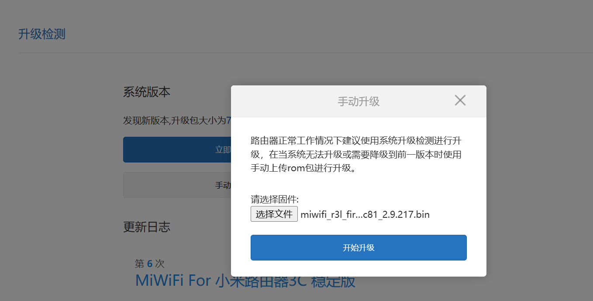
等待重启后，重新设置管理员密码。

# 2. 通过破解获取 telnet 权限

下载 R3GV2 patches，解压缩后，执行其中的 0.start_main.bat，按照提示输入路由器后台管理密码，当出现
start uploading config file...
run telnet+ftpd
Done
时表示已经成功获取 telnet 权限。
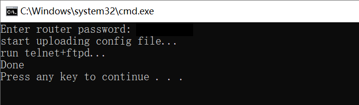

# 3. 刷入 Breed

- 打开 Windows 自带资源管理器，输入ftp://192.168.31.1，将 breed.bin 复制到路由器的 /tmp 目录下，这里不建议使用其他 ftp 软件，可能会出现无法显示文件目录的情况
- 使用 telnet 软件（建议 Xshell）连接路由器，提示输入用户名，输入 root 即可
  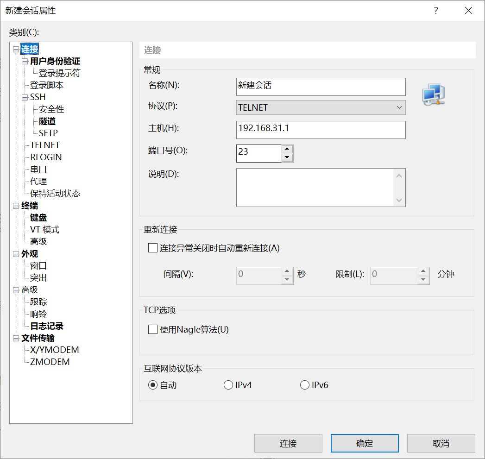
  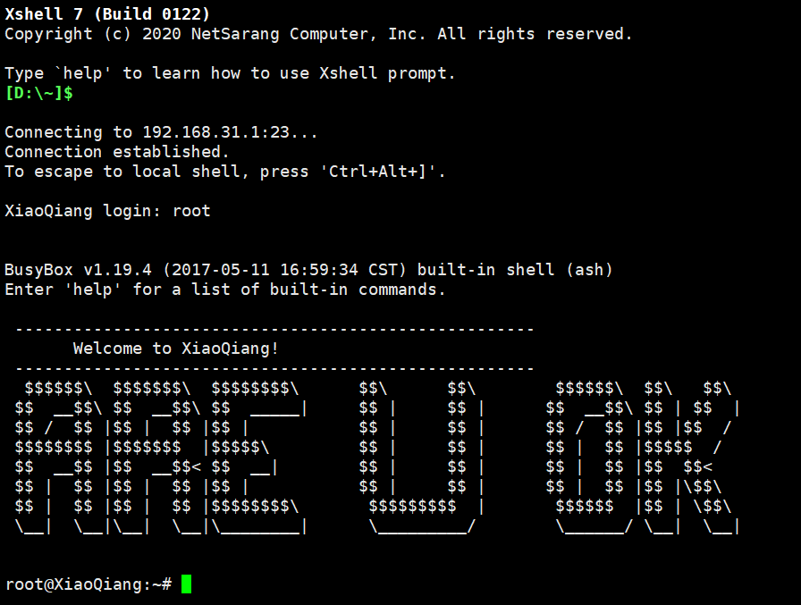
- 输入 **cat /proc/mtd** 查看分区信息
  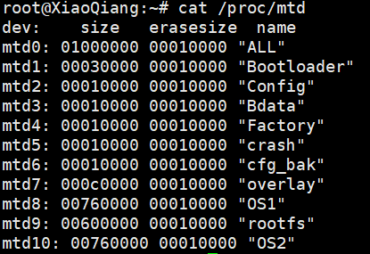
- 输入 **mtd write /tmp/breed.bin Bootloader**，将 breed.bin 刷入到 Bootloader 分区
  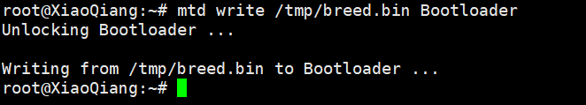
- 使用网线连接电脑和路由器的 LAN 口，长按路由器背后的 reset 键约5秒，打开浏览器，地址栏输入 192.168.1.1，进入 Breed Web 恢复控制台（请确保电脑本机 IP 处于 192.168.1.x 网段，如不是请自行修改本机 IP）
  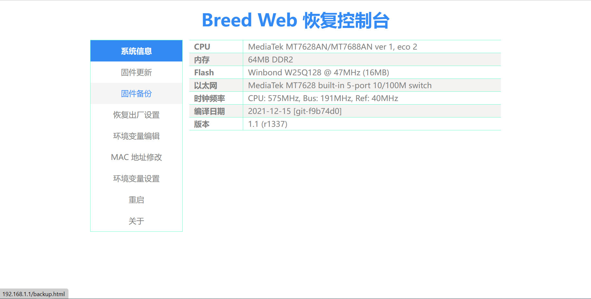

# 4. 配置 HFS

- 打开 HFS，点击 Menu → IP address，选择本机网卡的 IP 地址，设置监听 IP
  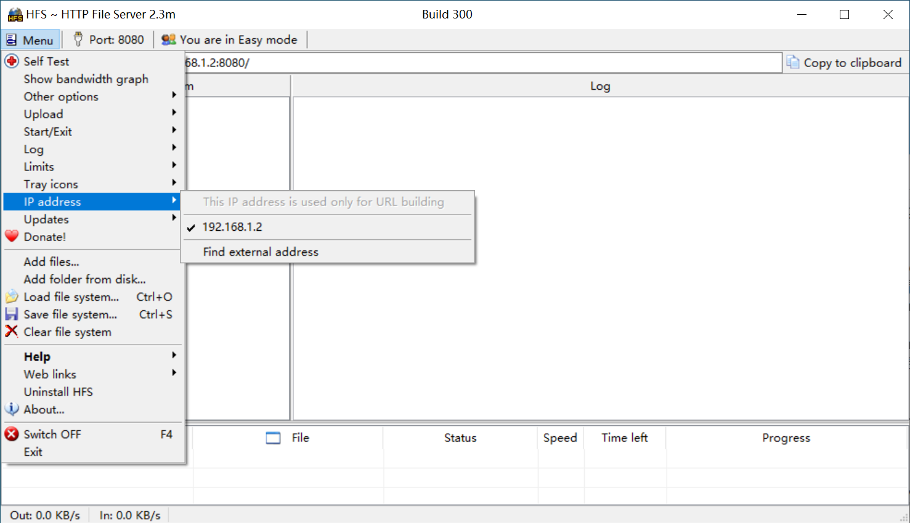
- 在软件左侧 Virtual File System 中，右键，选择 Add files...，将 OpenWrt 固件添加到监听列表
  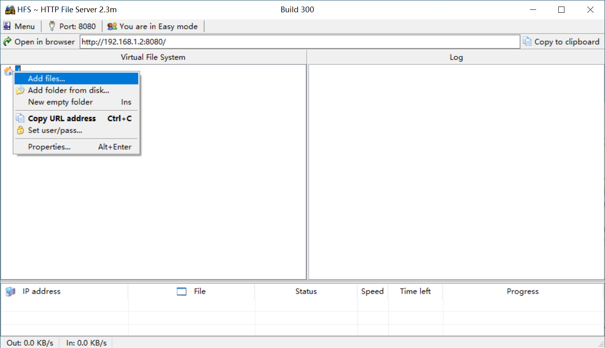
  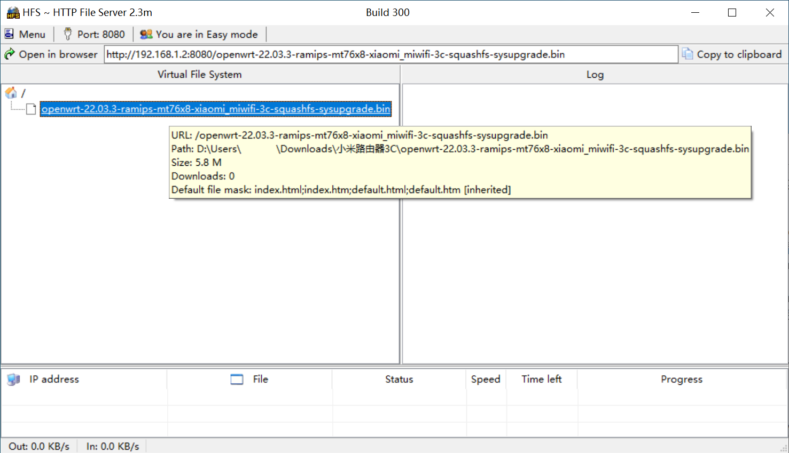
- 点击地址栏右侧的 Copy to clipboard，复制文件地址

# 5. 刷入 OpenWrt 固件

- 在 Breed 界面中，先备份 EEPROM，下载备份好的文件到本地
- 再次使用 telnet 软件连接路由器，注意此时的 IP 地址要改为 192.168.1.1
- 输入 **wget \*url\***，注意将 url 替换为步骤4中复制的文件地址，回车。当出现进度条 [0%] 时，需要手动多次按 enter 键（貌似任意键都可以），将固件下载到路由器上。
  注意查看下载完成后路由器返回的信息，记下固件大小 **0x5c0133** 和固件保存位置 **0x80000000** 这两个信息，后续步骤会用到
  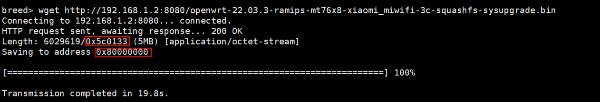
- 输入 **flash erase 0x140000 0x600000** 擦除 flash 原有数据。这里的 0x140000 表示 firmware 的地址，可以在 OpenWrt 官方的设备详情页面查看 openwrt.log 获取，0x600000 表示设定空间大小，这个空间大小必须大于固件大小 0x5c0133。
- 输入 **flash write 0x140000 0x80000000 0x600000** 写入固件，这行命令的意思是在地址 0x140000 处将保存在 0x80000000 位置的固件写入到已分配好的空间 0x600000 中。
- 输入 **boot flash 0x140000** 重启路由器，这行命令的意思是在 0x140000 处启动固件
  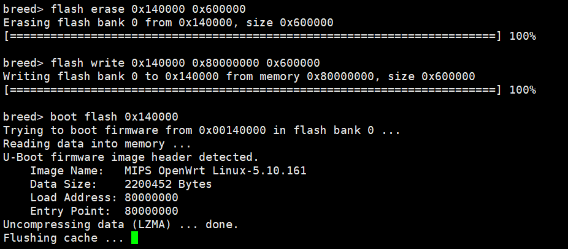
- 查看路由器指示灯，当指示灯由黄灯闪烁变为蓝灯时，浏览器地址栏输入 192.168.1.1，如果成功进入 openwrt 登录界面，代表固件已经成功刷入并启动了。此时先不着急配置网络，按住路由器的 reset 键，进入 breed

# 6. 设置环境变量

- 在 Breed 界面中，启用环境变量功能，位置选择 Breed 内部，点击设置，然后重启路由器使设置生效
- 再次进入 Breed 界面，编辑环境变量，增加字段 **autoboot.command**，值设为 **boot flash 0x140000**，表示从 0x140000 处启动固件，再次重启路由器

# 7. 重新写入固件

- 通过浏览器输入 192.168.1.1 进入 OpenWrt 后台管理界面，初始会要求设置 root 密码。
- 点击 System → Backup/Flash Firmware → Flash new firmware image，将刚刚刷入的 OpenWrt 再重新刷写一遍，然后点击 System → Reboot，重启路由器。这一步是为了将运行在 ram 中的固件真正地写入 rom 中，防止重启路由器后配置丢失。

# 8. 安装简体中文语言包

- 重启后进入 OpenWrt，点击 System → Software → Update lists，等待大约半分钟，刷新软件包列表，然后搜索 luci-i18n-base-zh-cn 和 luci-i18n-opkg-zh-cn，安装简体中文语言包。

# 9. 注意事项

- 必须准备一条网线，否则刷入breed后无法连接路由器后台
- 不建议刷 snapshots 版本，snapshots 默认不包含 LuCI GUI，且安装软件包具有时间限制
