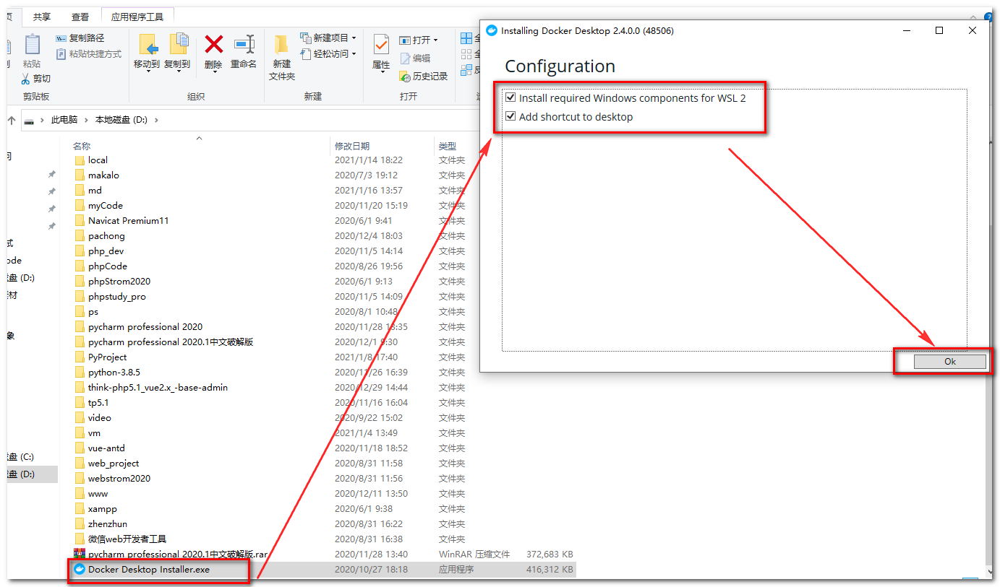
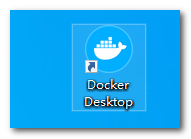
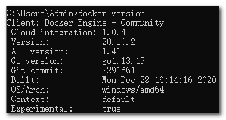
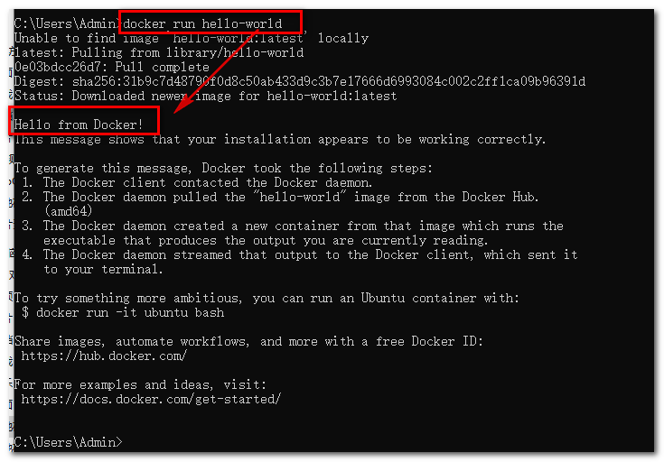
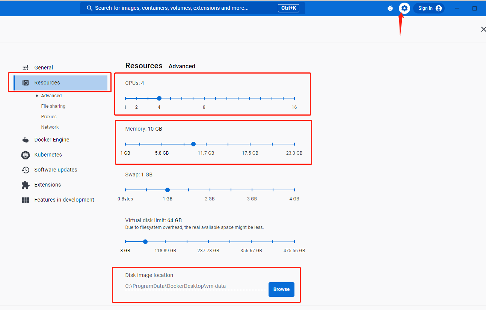
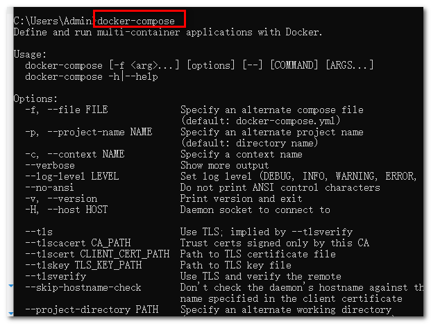
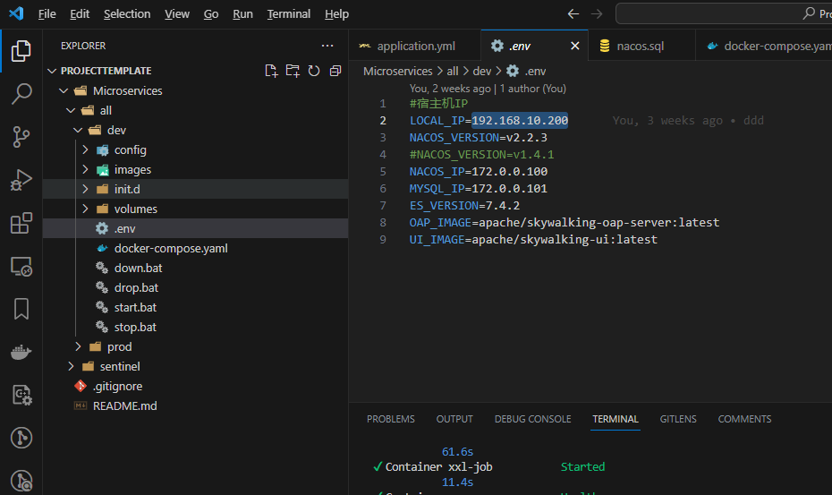
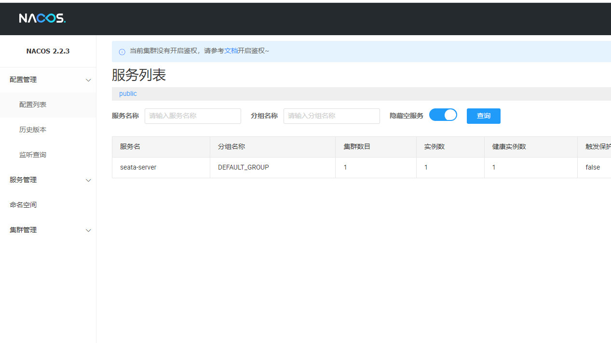
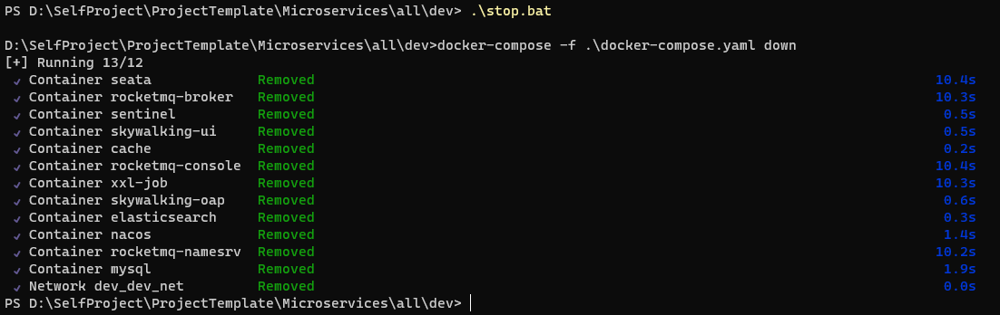

<center><h1>微服务开发环境docker一键搭建</h1></center>

## 一. 前置必备

- 安装中间件前必须先安装docker及docker-compose

- win10 docker,docker-compose 安装和配置

### 1. docker 安装(已安装跳过)

Docker 并非是一个通用的容器工具，它依赖于已存在并运行的 Linux 内核环境。

Docker 实质上是在已经运行的 Linux 下制造了一个隔离的文件环境，因此它执行的效率几乎等同于所部署的 Linux 主机。

因此，Docker 必须部署在 Linux 内核的系统上。如果其他系统想部署 Docker 就必须安装一个虚拟 Linux 环境。

在 Windows 上部署 Docker 的方法都是先安装一个虚拟机，并在安装 Linux 系统的的虚拟机中运行 Docker。

Win10 系统

Docker Desktop 是 Docker 在 Windows 10 和 macOS 操作系统上的官方安装方式，这个方法依然属于先在虚拟机中安装 Linux 然后再安装 Docker 的方法。

**注意：**

- 此方法仅适用于 Windows 10 操作系统专业版、企业版、教育版和部分家庭版！
- 要启用或安装Hyper-V

启用

也可以通过命令来启用 Hyper-V ，请右键开始菜单并以管理员身份运行 PowerShell，执行以下命令

```css
Enable-WindowsOptionalFeature -Online -FeatureName Microsoft-Hyper-V -All
```

win10 家庭版

https://jingyan.baidu.com/article/d7130635e5678113fcf4757f.html

下载docker

https://hub.docker.com/editions/community/docker-ce-desktop-windows/

这个下载会很慢，耐心等待

#### 1.1 安装

参考：

https://docs.docker.com/docker-for-windows/install-windows-home/

https://www.runoob.com/docker/windows-docker-install.html

双击下载好的安装包，进行安装



等待安装


安装完成后，双击桌面的图标运行



#### 1.2 WSL 2 installation is incomplete 的问题

如果出现

> WSL 2 installation is incomplete.


查看小鲸鱼的状态

如果红色就说明守护进程没有启动


可能是我们使用的wsl2版本老了,需要我们自己手动更新一下

参考：https://docs.microsoft.com/en-us/windows/wsl/install-win10

也有可能是没有开启wsl

参考：https://www.cnblogs.com/luhuaji/p/10892159.html

这里演示更新wsl，访问 https://docs.microsoft.com/en-us/windows/wsl/install-manual

找到第四步，点击下载


下载完后，开始安装更新，安装完了

右击重新启动一下


此时小鲸鱼


说明正常了

#### 1.3 测试

测试是否安装成功

按下 `win + R`输入`CMD` 输入

```undefined
docker version
```

如图表示成功



按下 `win + R`输入`CMD` 输入

```dockerfile
docker run hello-world
```



你运行这个你会发现很慢，这就需要配置镜像

### 2. docker 配置

**国内加速地址**

- Docker中国区官方镜像： `https://registry.docker-cn.com`
- 腾讯源： `https://mirror.ccs.tencentyun.com`
- 网易： `http://hub-mirror.c.163.com`
- 中国科技大学： `https://docker.mirrors.ustc.edu.cn`

#### 2.1 镜像设置

找到设置，设置地址,等待重启完毕


按下 `win + R`输入`CMD` 输入

```armasm
docker info
```

查看是否设置成功，如图表示设置成功


####  2.2 配置docker可用内存(必须配置, 不内存不够无法启动)

- 如图,安须配置, 最少2核8G内存, 存储路径不想放在C盘可以换到其它盘

  


### 3. docker-compose 安装

参考：https://docs.docker.com/compose/install/

我原本以为跟linux一样需要单独安装，没想官方说win版默认已经安装

看官方原文

> Install Compose on Windows desktop systems[🔗](https://docs.docker.com/compose/install/#install-compose-on-windows-desktop-systems)
>
> **Docker Desktop for Windows** includes Compose along with other Docker apps, so most Windows users do not need to install Compose separately. For install instructions, see [Install Docker Desktop on Windows](https://docs.docker.com/docker-for-windows/install/).
>
> If you are running the Docker daemon and client directly on Microsoft Windows Server, follow the instructions in the Windows Server tab.

我们来测试一下

按下 `win + R`输入`CMD` 输入

```undefined
docker-compose
```



## 二. 安装微服务中间件集群

#### 4.1拉取git仓库

``` powershell
git clone https://gitee.com/autumnzsd/ProjectTemplate.git
```

#### 4.1 配置本机IP

- 找到修改.env环境变量文件 LOCAL_IP 改成本机IP,(不能是127.0.01和localhost) , 会影响到中间件注册到nacos的服务IP, 不改有些中间件会无法使用.



#### 4.3使用docker-compose运行

- 进入目录 ProjectTemplate/Microservices/all/dev

- 运行 双击运行start.bat 即可

   说明一下, 运行前应确保6379 (redis)与 3306(mysql)端口没有被占用

  

- 测试下访问 nacos 地址是: [localhost:8848/nacos](localhost:8848/nacos)

  如图,即启动成功

  

- 需要停止的话则运行stop.bat 即可

  

## 三. 默认端口和服务说明

### rocketmq-namesrv
- 默认端口：9876
- 说明：RocketMQ名称服务器，用于管理和路由消息。

### mysql
- 默认端口：3306
- 说明：MySQL数据库服务，用于存储和管理数据。

### elasticsearch
- 默认端口：9200
- 说明：Elasticsearch是一个分布式搜索和分析引擎，用于全文搜索和实时数据分析。

### cache(即redis)
- 默认端口：6379
- 说明：缓存服务，可能是用于缓存数据的内存数据库或缓存代理。

### skywalking-oap
- 默认端口：12800
- 说明：Apache SkyWalking OAP（分析处理器），用于分析和处理跟踪数据。

### nacos
- 默认端口：8848
- 帐号:nacos, 密码:nacos
- 地址: localhost:8848/nacos
- 说明：Nacos是一个动态服务发现、配置和服务管理平台，用于微服务架构中的服务注册和配置管理。

### xxl-job
- 默认端口：28888
- 管理地址: http://localhost:28888/xxl-job-admin
- 说明：XXL-Job是一个分布式任务调度平台，用于定时和异步执行任务。

### rocketmq-broker
- 默认端口：
  - 10911（Broker之间通信端口）
  - 10909（Broker与名称服务器通信端口）
  - 10912（客户端访问端口）
- 说明：RocketMQ Broker，用于存储和传输消息的代理服务器。

### rocketmq-console
- 默认端口：8081
- 地址: localhost:8081
- 说明：RocketMQ控制台，用于监控和管理RocketMQ实例。

### skywalking-ui
- 默认端口：8082
- 地址: localhost:8082
- 说明：Apache SkyWalking UI，用于可视化展示SkyWalking的跟踪和监控数据。

### sentinel
- 默认端口：8080
- 帐号:sentinel, 密码:sentinel
- 地址: localhost:8080
- 说明：Sentinel是一个流量控制和熔断降级的开源框架，用于保护和控制微服务架构中的服务。

### seata
- 默认端口：7091
- 地址: localhost:7091
- 帐号:seata, 密码:seata
- 说明：Seata是一个开源的分布式事务解决方案，用于管理和协调分布式事务。


