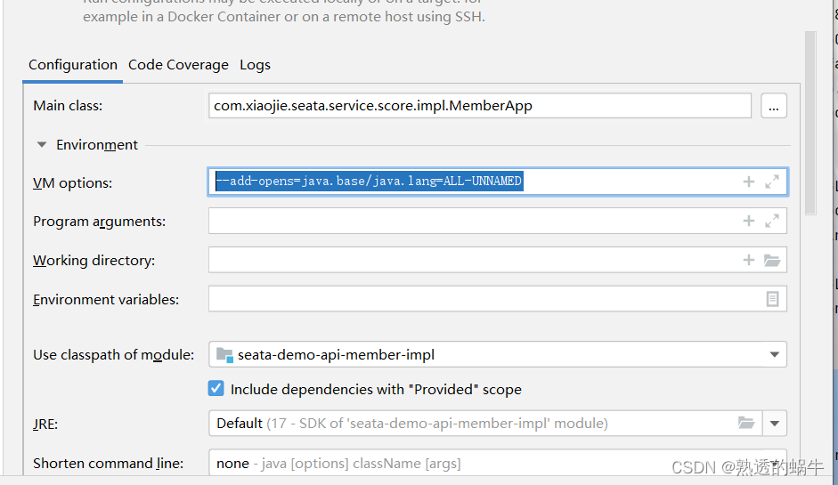

# 解决jdk17启动seata报错的问题

**1、如果报jvm启动失败，是因为启动参数的垃圾回收参数不对，应该是在jdk14之后，已经丢弃了cms垃圾回收器，所以修改响应的垃圾回收器参数即可。**

**2、如果报错如下**


**启动参数 添加 --add-opens=java.base/java.lang=ALL-UNNAMED**

完整的启动参数为（修改seata-server.bat，这是window环境的启动参数，linux根据需要灵活修改）


```
%JAVACMD% %JAVA_OPTS% -server --add-opens=java.base/java.lang=ALL-UNNAMED -Xmx2048m -Xms2048m -Xmn1024m -Xss512k -XX:SurvivorRatio=10 -XX:MetaspaceSize=128m -XX:MaxMetaspaceSize=256m -XX:MaxDirectMemorySize=1024m -XX:-OmitStackTraceInFastThrow -XX:-UseAdaptiveSizePolicy -XX:+HeapDumpOnOutOfMemoryError -XX:HeapDumpPath="%BASEDIR%"/logs/java_heapdump.hprof -XX:+DisableExplicitGC  -Xlog:gc:"%BASEDIR%"/logs/seata_gc.log -verbose:gc -Dio.netty.leakDetectionLevel=advanced -Dlogback.color.disable-for-bat=true -classpath %CLASSPATH% -Dapp.name="seata-server" -Dapp.repo="%REPO%" -Dapp.home="%BASEDIR%" -Dbasedir="%BASEDIR%" io.seata.server.Server %CMD_LINE_ARGS%
```


**3、idea启动项目时候报如下错误**


```
Error starting ApplicationContext. To display the conditions report re-run your application with 'debug' enabled.
2022-01-03 21:58:40.961 ERROR 81432 --- [           main] o.s.boot.SpringApplication               : Application run failed
 
org.springframework.beans.factory.BeanCreationException: Error creating bean with name 'globalTransactionScanner' defined in class path resource [io/seata/spring/boot/autoconfigure/SeataAutoConfiguration.class]: Bean instantiation via factory method failed; nested exception is org.springframework.beans.BeanInstantiationException: Failed to instantiate [io.seata.spring.annotation.GlobalTransactionScanner]: Factory method 'globalTransactionScanner' threw exception; nested exception is java.lang.ExceptionInInitializerError
    at org.springframework.beans.factory.support.ConstructorResolver.instantiate(ConstructorResolver.java:658) ~[spring-beans-5.3.3.jar:5.3.3]
    at org.springframework.beans.factory.support.ConstructorResolver.instantiateUsingFactoryMethod(ConstructorResolver.java:638) ~[spring-beans-5.3.3.jar:5.3.3]
    at org.springframework.beans.factory.support.AbstractAutowireCapableBeanFactory.instantiateUsingFactoryMethod(AbstractAutowireCapableBeanFactory.java:1336) ~[spring-beans-5.3.3.jar:5.3.3]
    at org.springframework.beans.factory.support.AbstractAutowireCapableBeanFactory.createBeanInstance(AbstractAutowireCapableBeanFactory.java:1179) ~[spring-beans-5.3.3.jar:5.3.3]
    at org.springframework.beans.factory.support.AbstractAutowireCapableBeanFactory.doCreateBean(AbstractAutowireCapableBeanFactory.java:571) ~[spring-beans-5.3.3.jar:5.3.3]
    at org.springframework.beans.factory.support.AbstractAutowireCapableBeanFactory.createBean(AbstractAutowireCapableBeanFactory.java:531) ~[spring-beans-5.3.3.jar:5.3.3]
    at org.springframework.beans.factory.support.AbstractBeanFactory.lambda$doGetBean$0(AbstractBeanFactory.java:335) ~[spring-beans-5.3.3.jar:5.3.3]
    at org.springframework.beans.factory.support.DefaultSingletonBeanRegistry.getSingleton(DefaultSingletonBeanRegistry.java:234) ~[spring-beans-5.3.3.jar:5.3.3]
    at org.springframework.beans.factory.support.AbstractBeanFactory.doGetBean(AbstractBeanFactory.java:333) ~[spring-beans-5.3.3.jar:5.3.3]
    at org.springframework.beans.factory.support.AbstractBeanFactory.getBean(AbstractBeanFactory.java:213) ~[spring-beans-5.3.3.jar:5.3.3]
    at org.springframework.context.support.PostProcessorRegistrationDelegate.registerBeanPostProcessors(PostProcessorRegistrationDelegate.java:232) ~[spring-context-5.3.3.jar:5.3.3]
    at org.springframework.context.support.AbstractApplicationContext.registerBeanPostProcessors(AbstractApplicationContext.java:767) ~[spring-context-5.3.3.jar:5.3.3]
    at org.springframework.context.support.AbstractApplicationContext.refresh(AbstractApplicationContext.java:572) ~[spring-context-5.3.3.jar:5.3.3]
    at org.springframework.boot.web.servlet.context.ServletWebServerApplicationContext.refresh(ServletWebServerApplicationContext.java:144) ~[spring-boot-2.4.2.jar:2.4.2]
    at org.springframework.boot.SpringApplication.refresh(SpringApplication.java:767) ~[spring-boot-2.4.2.jar:2.4.2]
    at org.springframework.boot.SpringApplication.refresh(SpringApplication.java:759) ~[spring-boot-2.4.2.jar:2.4.2]
    at org.springframework.boot.SpringApplication.refreshContext(SpringApplication.java:426) ~[spring-boot-2.4.2.jar:2.4.2]
    at org.springframework.boot.SpringApplication.run(SpringApplication.java:326) ~[spring-boot-2.4.2.jar:2.4.2]
    at org.springframework.boot.SpringApplication.run(SpringApplication.java:1311) ~[spring-boot-2.4.2.jar:2.4.2]
    at org.springframework.boot.SpringApplication.run(SpringApplication.java:1300) ~[spring-boot-2.4.2.jar:2.4.2]
    at com.xiaojie.seata.order.impl.OrderApp.main(OrderApp.java:19) ~[classes/:na]
Caused by: org.springframework.beans.BeanInstantiationException: Failed to instantiate [io.seata.spring.annotation.GlobalTransactionScanner]: Factory method 'globalTransactionScanner' threw exception; nested exception is java.lang.ExceptionInInitializerError
    at org.springframework.beans.factory.support.SimpleInstantiationStrategy.instantiate(SimpleInstantiationStrategy.java:185) ~[spring-beans-5.3.3.jar:5.3.3]
    at org.springframework.beans.factory.support.ConstructorResolver.instantiate(ConstructorResolver.java:653) ~[spring-beans-5.3.3.jar:5.3.3]
    ... 20 common frames omitted
Caused by: java.lang.ExceptionInInitializerError: null
    at net.sf.cglib.core.KeyFactory$Generator.generateClass(KeyFactory.java:166) ~[cglib-3.1.jar:na]
    at net.sf.cglib.core.DefaultGeneratorStrategy.generate(DefaultGeneratorStrategy.java:25) ~[cglib-3.1.jar:na]
    at net.sf.cglib.core.AbstractClassGenerator.create(AbstractClassGenerator.java:216) ~[cglib-3.1.jar:na]
    at net.sf.cglib.core.KeyFactory$Generator.create(KeyFactory.java:144) ~[cglib-3.1.jar:na]
    at net.sf.cglib.core.KeyFactory.create(KeyFactory.java:116) ~[cglib-3.1.jar:na]
    at net.sf.cglib.core.KeyFactory.create(KeyFactory.java:108) ~[cglib-3.1.jar:na]
    at net.sf.cglib.core.KeyFactory.create(KeyFactory.java:104) ~[cglib-3.1.jar:na]
    at net.sf.cglib.proxy.Enhancer.<clinit>(Enhancer.java:69) ~[cglib-3.1.jar:na]
    at io.seata.config.ConfigurationCache.proxy(ConfigurationCache.java:88) ~[seata-all-1.4.2.jar:1.4.2]
    at io.seata.config.ConfigurationFactory.buildConfiguration(ConfigurationFactory.java:136) ~[seata-all-1.4.2.jar:1.4.2]
    at io.seata.config.ConfigurationFactory.getInstance(ConfigurationFactory.java:94) ~[seata-all-1.4.2.jar:1.4.2]
    at io.seata.spring.annotation.GlobalTransactionScanner.<init>(GlobalTransactionScanner.java:87) ~[seata-all-1.4.2.jar:1.4.2]
    at io.seata.spring.annotation.GlobalTransactionScanner.<init>(GlobalTransactionScanner.java:143) ~[seata-all-1.4.2.jar:1.4.2]
    at io.seata.spring.boot.autoconfigure.SeataAutoConfiguration.globalTransactionScanner(SeataAutoConfiguration.java:55) ~[seata-spring-boot-starter-1.4.2.jar:na]
    at java.base/jdk.internal.reflect.NativeMethodAccessorImpl.invoke0(Native Method) ~[na:na]
    at java.base/jdk.internal.reflect.NativeMethodAccessorImpl.invoke(NativeMethodAccessorImpl.java:77) ~[na:na]
    at java.base/jdk.internal.reflect.DelegatingMethodAccessorImpl.invoke(DelegatingMethodAccessorImpl.java:43) ~[na:na]
    at java.base/java.lang.reflect.Method.invoke(Method.java:568) ~[na:na]
    at org.springframework.beans.factory.support.SimpleInstantiationStrategy.instantiate(SimpleInstantiationStrategy.java:154) ~[spring-beans-5.3.3.jar:5.3.3]
    ... 21 common frames omitted
Caused by: java.lang.reflect.InaccessibleObjectException: Unable to make protected final java.lang.Class java.lang.ClassLoader.defineClass(java.lang.String,byte[],int,int,java.security.ProtectionDomain) throws java.lang.ClassFormatError accessible: module java.base does not "opens java.lang" to unnamed module @1aa7ecca
    at java.base/java.lang.reflect.AccessibleObject.checkCanSetAccessible(AccessibleObject.java:354) ~[na:na]
    at java.base/java.lang.reflect.AccessibleObject.checkCanSetAccessible(AccessibleObject.java:297) ~[na:na]
    at java.base/java.lang.reflect.Method.checkCanSetAccessible(Method.java:199) ~[na:na]
    at java.base/java.lang.reflect.Method.setAccessible(Method.java:193) ~[na:na]
    at net.sf.cglib.core.ReflectUtils$2.run(ReflectUtils.java:56) ~[cglib-3.1.jar:na]
    at java.base/java.security.AccessController.doPrivileged(AccessController.java:318) ~[na:na]
    at net.sf.cglib.core.ReflectUtils.<clinit>(ReflectUtils.java:46) ~[cglib-3.1.jar:na]
    ... 40 common frames omitted
```


**在jvm启动参数上添加--add-opens=java.base/java.lang=ALL-UNNAMED**

**
**




**4、启动之后如果报如下错误，不用怀疑，一定是你的config.txt导入的时候配置与application.yml的配置不一致**

**
**

****

**
**

 **5、如果启动报一下错误**


```
java: java.lang.IllegalAccessError: class lombok.javac.apt.LombokProcessor (in unnamed module @0x68b859c5) cannot access class com.sun.tools.javac.processing.JavacProcessingEnvironment (in module jdk.compiler) because module jdk.compiler does not export com.sun.tools.javac.processing to unnamed module @0x68b859c5
```


**只需要将 maven添加版本号即可**


<dependency>

   <groupId>org.projectlombok</groupId>

   <artifactId>lombok</artifactId>

   <version>1.18.20</version>

   <optional>true</optional>

</dependency>
