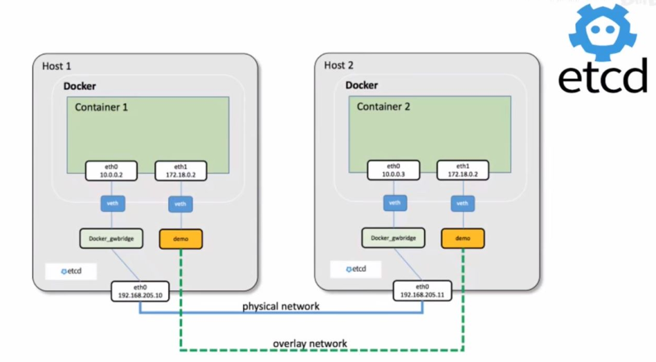
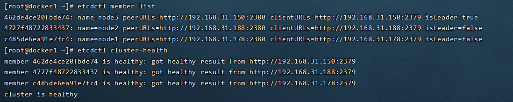
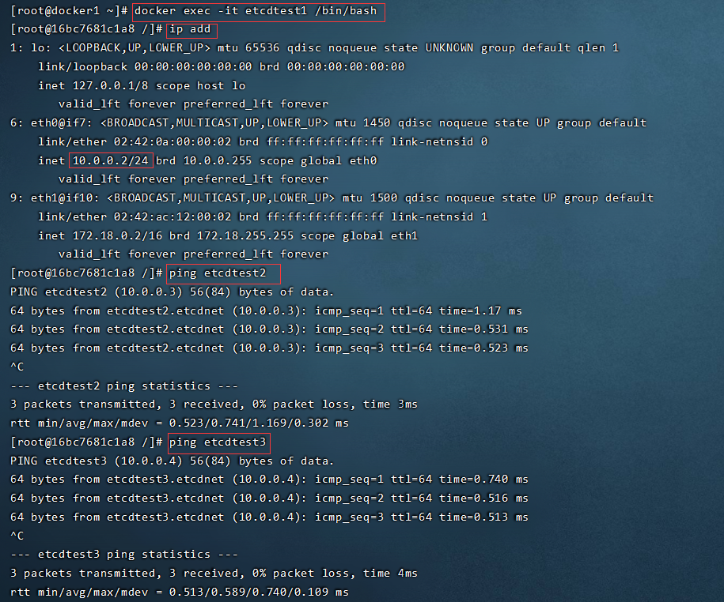
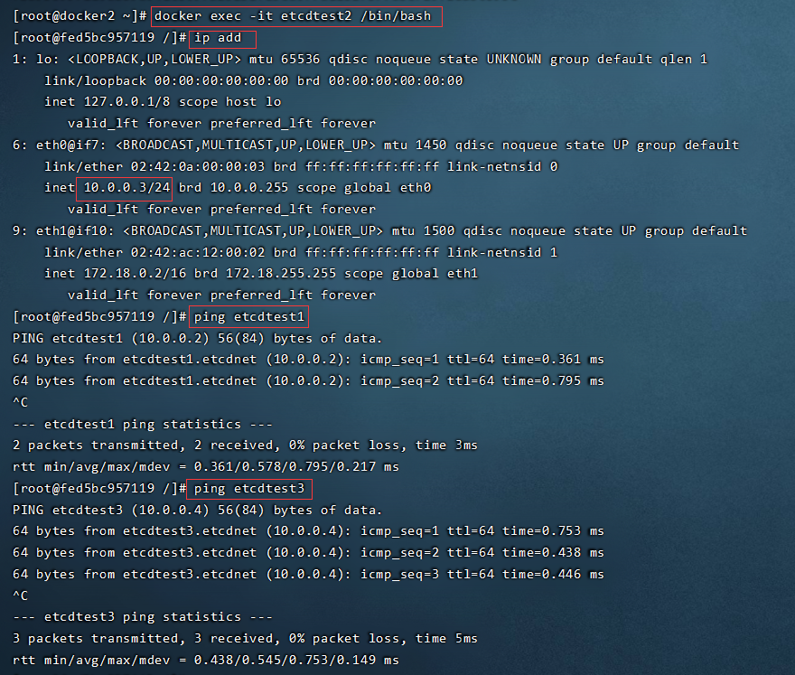
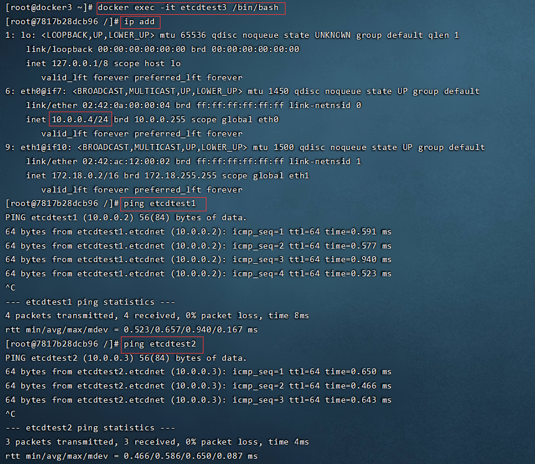
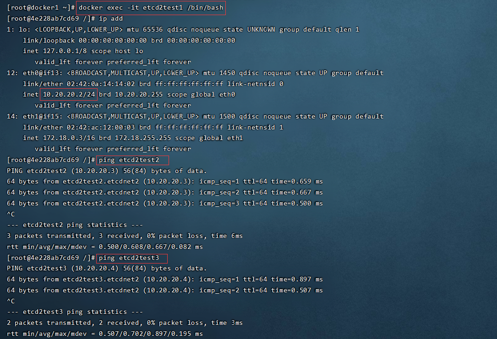
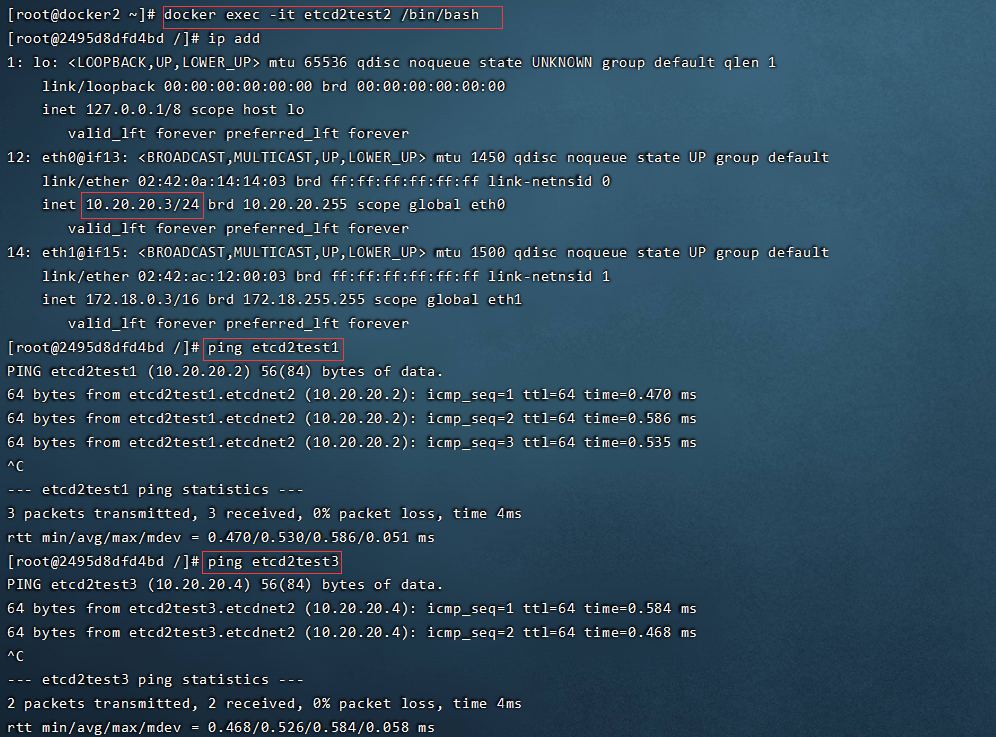
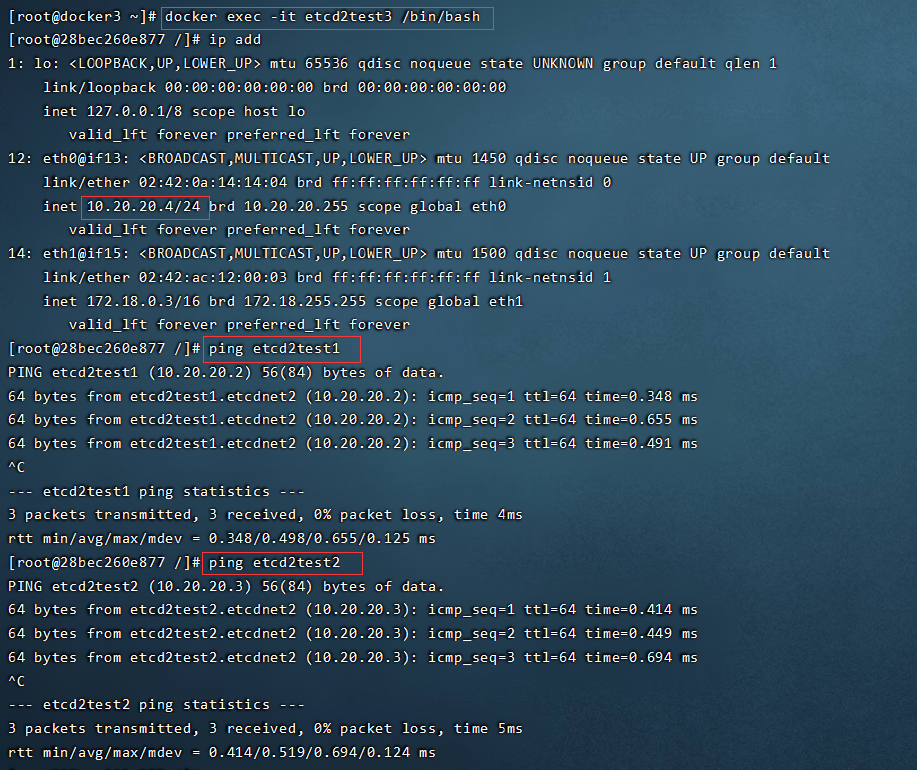

# [Docker 跨主机互联(Overlay - etcd)](https://www.cnblogs.com/klvchen/articles/15172346.html)



## 环境

| 主机    | IP            |
| ------- | ------------- |
| docker1 | 192.168.10.80 |
| docker2 | 192.168.10.81 |
| docker3 | 192.168.10.82 |

前提：

1. 安装好 docker
2. 关闭防火墙和 selinux

## 安装 etcd（三个节点）

```mipsasm
apt install etcd -y
```

## 配置 etcd

docker1

```makefile
# 需要修改的地方
vim /etc/default/etcd
ETCD_LISTEN_PEER_URLS="http://192.168.10.80:2380"
ETCD_LISTEN_CLIENT_URLS="http://192.168.10.80:2379,http://127.0.0.1:2379"
ETCD_NAME="node1"
ETCD_INITIAL_ADVERTISE_PEER_URLS="http://192.168.10.80:2380"
ETCD_ADVERTISE_CLIENT_URLS="http://192.168.10.80:2379"
ETCD_INITIAL_CLUSTER="node1=http://192.168.10.80:2380,node2=http://192.168.10.81:2380,node3=http://192.168.10.82:2380"
ETCD_INITIAL_CLUSTER_TOKEN="etcd-cluster"
ETCD_INITIAL_CLUSTER_STATE="new"

# 启动
systemctl restart etcd
```

docker2

```makefile
# 需要修改的地方
vim /etc/default/etcd
ETCD_LISTEN_PEER_URLS="http://192.168.10.81:2380"
ETCD_LISTEN_CLIENT_URLS="http://192.168.10.81:2379,http://127.0.0.1:2379"
ETCD_NAME="node2"
ETCD_INITIAL_ADVERTISE_PEER_URLS="http://192.168.10.81:2380"
ETCD_ADVERTISE_CLIENT_URLS="http://192.168.10.81:2379"
ETCD_INITIAL_CLUSTER="node1=http://192.168.10.80:2380,node2=http://192.168.10.81:2380,node3=http://192.168.10.82:2380"
ETCD_INITIAL_CLUSTER_TOKEN="etcd-cluster"
ETCD_INITIAL_CLUSTER_STATE="new"

# 启动
systemctl restart etcd
```

docker3

```makefile
# 需要修改的地方
vim /etc/default/etcd
ETCD_LISTEN_PEER_URLS="http://192.168.10.82:2380"
ETCD_LISTEN_CLIENT_URLS="http://192.168.10.82:2379,http://127.0.0.1:2379"
ETCD_NAME="node3"
ETCD_INITIAL_ADVERTISE_PEER_URLS="http://192.168.10.82:2380"
ETCD_ADVERTISE_CLIENT_URLS="http://192.168.10.82:2379"
ETCD_INITIAL_CLUSTER="node1=http://192.168.10.80:2380,node2=http://192.168.10.81:2380,node3=http://192.168.10.82:2380"
ETCD_INITIAL_CLUSTER_TOKEN="etcd-cluster"
ETCD_INITIAL_CLUSTER_STATE="new"

# 启动
systemctl restart etcd
```

## 检查 etcd

```sql
etcdctl member list
etcdctl cluster-health
```



## 修改 Docker 配置参数

docker1

```bash
vim /etc/docker/daemon.json 
{
        "cluster-store": "etcd://192.168.10.80:2379",
        "cluster-advertise": "192.168.10.80:2379"
}

systemctl restart docker
```

docker2

```bash
vim /etc/docker/daemon.json 
{
        "cluster-store": "etcd://192.168.10.81:2379",
        "cluster-advertise": "192.168.10.81:2379"
}

systemctl restart docker
```

docker3

```bash
vim /etc/docker/daemon.json 
{
        "cluster-store": "etcd://192.168.10.82:2379",
        "cluster-advertise": "192.168.10.82:2379"
}

systemctl restart docker
```

## 创建 Docker 网络和容器

```haskell
# docker1
docker network create --driver overlay etcdnet
docker run -it -d --name etcdtest1 --network etcdnet centos:centos8

# docker2
docker run -it -d --name etcdtest2 --network etcdnet centos:centos8

# docker3
docker run -it -d --name etcdtest3 --network etcdnet centos:centos8
```

## 测试

docker1


docker2


docker3


## 创建自定义 Docker 网络

docker1

```css
docker network create --driver overlay --subnet 10.20.20.0/24 etcdnet2
docker run -it -d --name etcd2test1 --network etcdnet2 centos:centos8
```

docker2

```css
docker run -it -d --name etcd2test2 --network etcdnet2 centos:centos8
```

docker3

```css
docker run -it -d --name etcd2test3 --network etcdnet2 centos:centos8
```

## 测试

docker1


docker2


docker3
