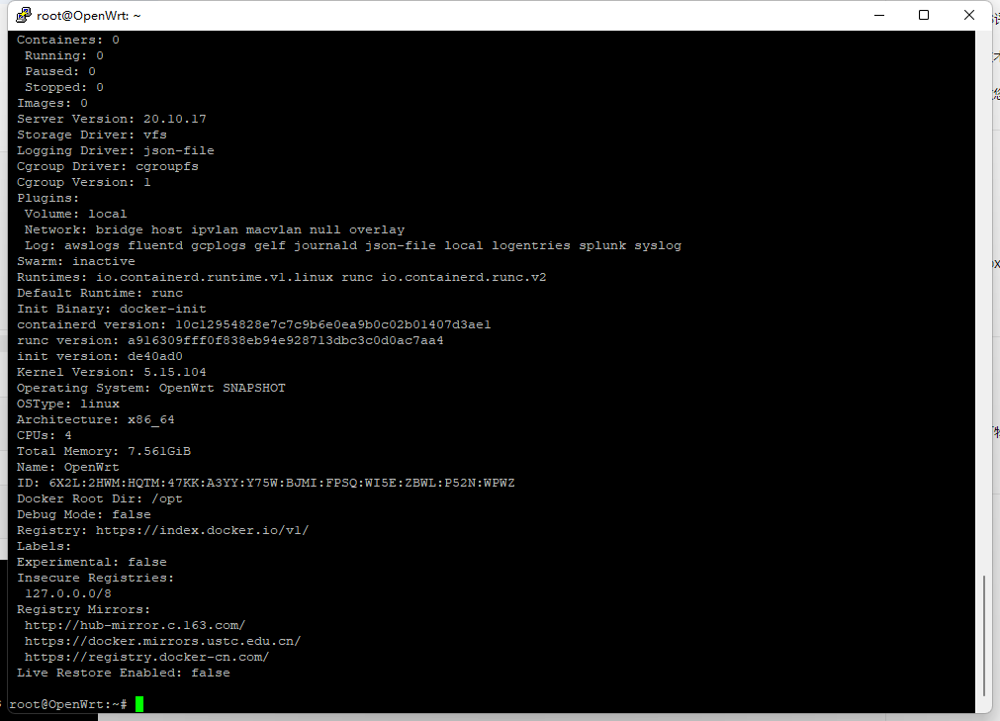

- # docker 设置国内镜像源

### 国内加速地址

1.Docker中国区官方镜像

https://registry.docker-cn.com

2.网易

http://hub-mirror.c.163.com

3.ustc

https://docker.mirrors.ustc.edu.cn

4.中国科技大学

[https://docker.mirrors.ustc.edu.cn](https://docker.mirrors.ustc.edu.cn?spm=a2c6h.12873639.article-detail.10.5a3f45e4Z5zGCv)

5.阿里云容器 生成自己的加速地址

登录：cr.console.aliyun.com

点击“创建我的容器镜像”，得到专属加速地址。


### 修改方法

创建或修改 /etc/docker/daemon.json 文件，修改为如下形式

```
{
    "registry-mirrors": [
        "http://hub-mirror.c.163.com",
        "https://docker.mirrors.ustc.edu.cn",
        "https://registry.docker-cn.com"
    ]
}
```

加载[重启docker](https://so.csdn.net/so/search?q=重启docker&spm=1001.2101.3001.7020)

```
service docker restart
```

查看是否成功

```
docker info
```


