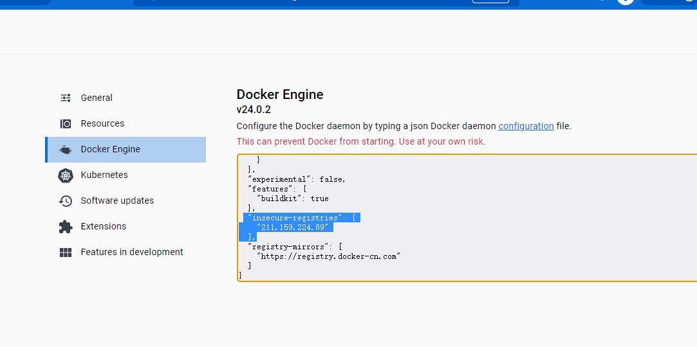

# 搭建docker私有仓库 harbor

## 一. 安装
harbor安装需要依赖docker-compose
### 1.安装docker-compose
```bash
#1.29.2可替换成对应的版本
curl -L "https://github.com/docker/compose/releases/download/1.29.2/docker-compose-$(uname -s)-$(uname -m)" -o /usr/local/bin/docker-compose
```
### 2. 授予执行权限
```bash
chmod u+x /usr/local/bin/docker-compose
```
### 3. 离线下载Harbor安装包
```bash
wget https://github.com/goharbor/harbor/releases/download/v2.5.1/harbor-offline-installer-v2.5.1.tgz
```

### 4. 解压安装包
tar xf  harbor-offline-installer-v2.5.1.tgz

### 5. 复制harbor.yml文件，并修改配置
```bash
cp harbor.yml.tmpl harbor.yml
vim harbor.yml
```
#更改hostname(hostname测过不支持设置成 0.0.0.0, 改为本地IP,不要使用公网ip)  
#注释掉https 要不然安装报错

### 6. 开始安装
```bash
./install.sh
```
### 7. 安装完成，用浏览器输入ip访问（默认账号是admin  密码是Harbor12345）
## 二. 客户端使用

### 1.使用 docker login 登录harbor
```bash
docker login 211.159.224.89
```

### 2.修改镜像tag

```bash
#设已有本地镜像 isa:1.0
#211.159.224.89为服务器IP
docker tag isa:1.0 211.159.224.89/library/isa:1.0
```

### 3. Push镜像

```bash
docker push 211.159.224.89/library/isa:1.0
```


##### 这里因为这里没有加协议名, 它默认会使用https, 而我们刚搭建的服务端使用的为80, 会报错, unauthorized to access repository: library/isa, actin: push: unauthorized to access repository: library/isa, action: push

所以这里要修改更改下docker客户端的配置才可以, 配置如下:

``` json
 "insecure-registries": ["211.159.224.89"]
```

#### linux:

在Linux系统上，Docker的配置文件通常位于`/etc/docker/daemon.json`。你可以按照以下步骤进行编辑：

如果文件不存在，可以创建一个新的`daemon.json`文件

``` bash
vi /etc/docker/daemon.json
```

写入:

``` json
{
    "insecure-registries": ["211.159.224.89"]
}
```


#### windows:

   



##### 最后重启下docker服务 

  ``` bash 
  systemctl restart docker
  ```

### 4.Pull

```bash
docker pull 211.159.224.89/library/isa:1.0
```

