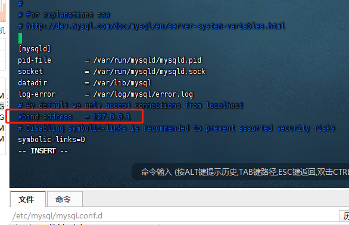
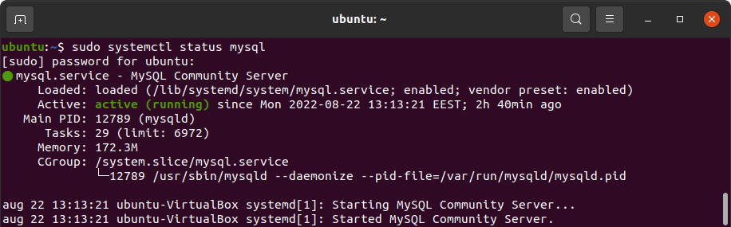

## 安装MySql5.7 (ubuntu)

### Step 1: Add the MySQL 5.7 APT Repository

**1.1** Download the MySQL repository by executing the following command:

```bash
wget https://dev.mysql.com/get/mysql-apt-config_0.8.12-1_all.deb
```

**1.2** After the MySQL package has been successfully downloaded, install it:

```bash
sudo dpkg -i mysql-apt-config_0.8.12-1_all.deb
```

**1.3** Next, select **Ubuntu Bionic.**

- 如果不小心选到了别的选项, 执行命令移除,再执行1.2(非必要)

  ```
  sudo dpkg --purge mysql-apt-config
  ```

  


After that, select the **MySQL Server & Cluster** option. Then, select **mysql-5.7** and finally select **Ok**.


**1.4** Next, update the APT repository:

```
sudo apt update
```


*Note*

*If you encounter the **"signature couldn't be verified"** error like this one: NO_PUBKEY 467B942D3A79BD29, you will need to import the missing gpg key by running the following command:*


```
sudo apt-key adv --keyserver keyserver.ubuntu.com --recv-keys 467B942D3A79BD29
```

**1.5** Then execute the apt update again:


```
sudo apt update
```

To check whether MySQL 5.7 repository has been successfully installed, execute:


```
sudo apt-cache policy mysql-server
```

You should see MySQL 5.7 repository at the bottom of the list.


### Step 2: Install MySQL 5.7

**2.1** Now that you have a MySQL 5.7 repository in your system, you can proceed to install it. For this, run the following command:


```
sudo apt install -f mysql-client=5.7* mysql-community-server=5.7* mysql-server=5.7*
```

**2.2** Press **Y** to begin the installation and set the root password when asked.

### 2 - Allow root remote access step by step instructions (这里可设置root用户可远程登录,默认只允许本地)

**NOTE**
Even after configuring MySQL to allow remote connections to the root account, you still need to allow connections to MySQL through the Linux firewall and make sure that MySQL is bound to an accessible interface. If you have not already configured those aspects, first see our guide on [MySQL: Allow remote connections](https://linuxconfig.org/mysql-allow-remote-connections) and then come back.

1. To allow remote connections to the root account in MySQL, you should execute the

    

   ```
   mysql_secure_installation
   ```

    

   command. Normally you run this command when first setting up MySQL, but it can be run again at any point if you need to reset the root account password or allow remote connections to the account.

   ```
   $ sudo mysql_secure_installation
   ```

2. Follow the prompts until you reach one that asks `Disallow root login remotely?` and on this prompt, simply enter `no`.

3. Once you finish going through the rest of the prompts, you will be able to access your MySQL server from remote systems using the root account. Of course, this is assuming that your firewall is correctly configured and your MySQL server (port 3306 by default) is already accessible over the internet.

4. If this does not work for you, you can try editing the

    

   ```
   mysql.user
   ```

    

   entry for root directly.

   ```
   mysql> GRANT ALL PRIVILEGES ON *.* TO 'root'@'localhost';
   mysql> UPDATE mysql.user SET host='%' WHERE user='root';
   ```

   And then restart MySQL:

   ```
   $ sudo systemctl restart mysql
   ```


Before starting to use MySQL 5.7, you need to secure it first. For this, use the command:

- 修改IP绑定, 默认只允许本机访问

**vim /etc/mysql/mysql.conf.d/mysqld.cnf  注释掉  bind-address   = 127.0.0.1 ** 




- 添加最大连接数

```bash
vim  /etc/mysql/mysql.conf.d/mysqld.cnf
# bind-address   = 127.0.0.1
#添加
max_connections=500
```


 

### 3 – Check the MySQL version(可选)

Want to make sure that you have installed everything correctly? You can do that by checking your current MySQL version. First, you need to log in to MySQL using the root password you have set earlier.


```
mysql -u root -p
```

After that, execute the following command:


```
SELECT VERSION();
```

You should see your installed MySQL version.


### 4 - Add MySQL user and set privileges(可选)

To create a new MySQL user account on Ubuntu, use the following command:


```
CREATE USER 'username'@'localhost' IDENTIFIED BY 'user_password';
```

*Note*

*To allow a user remote access to MySQL on Ubuntu, we recommend creating a user with access from a specific IP address ('username'@'192.168.1.100') or from any host ('username'@'%').*


Now that we have created a new account, we can grant privileges to it. Suppose, we want to give the user the privilege to create and select database objects. For this, we run:


```
GRANT CREATE, SELECT ON *.* TO 'username'@'localhost';
```

If you want to get the list of all the users in MySQL, execute the following command:


```
SELECT user FROM mysql.user;
```


As you can see, we have been successful in the endeavor of creating a new user.

### 5 - Test MySQL 5.7

After installation, MySQL server starts running automatically. However, if you need to verify that, execute the command:


```
sudo systemctl status mysql
```

The output should show that the service is active.


