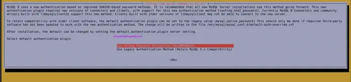

#  The below steps describe how to install and configure MySQL 8.0 on Ubuntu 22.04|20.04


## Step 1: Add MySQL APT repository

***Ubuntu 22.04 already comes with MySQL 8.0 packages\***. You can skip repository addition on Ubuntu 22.04, only perform the operation on Ubuntu 20.04.

Download the repository using the below command:

```
wget https://dev.mysql.com/get/mysql-apt-config_0.8.26-1_all.deb
```

Once downloaded, install the repository by running the command below:

```
sudo dpkg -i mysql-apt-config_0.8.26-1_all.deb
```

The next prompt shows MySQL 8.0 chosen by default. Choose the first option and click **OK**

[](https://computingforgeeks.com/wp-content/uploads/2020/10/How-to-install-mysql-8.0-on-ubuntu-20.04-06.png?ezimgfmt=rs:696x123/rscb23/ng:webp/ngcb23)

In the next prompt, select **MySQL 8.0** server and click **OK**.


[](https://computingforgeeks.com/wp-content/uploads/2020/10/How-to-install-mysql-8.0-on-ubuntu-20.04-01.png?ezimgfmt=rs:696x106/rscb23/ng:webp/ngcb23)

The next prompt selects MySQL8 by default. Choose the last option ***Ok*** and click **OK**.

## Step 2: Update MySQL Repository

Run the below command to update your system packages index list.

```
sudo apt update
```

Now search for MySQL 8.0 using apt cache as shown below:

```
### Ubuntu 22.04 ###
$ apt-cache policy mysql-server
mysql-server:
  Installed: (none)
  Candidate: 8.0.34-1ubuntu22.04
  Version table:
     8.0.34-1ubuntu22.04 500
        500 http://repo.mysql.com/apt/ubuntu jammy/mysql-8.0 amd64 Packages
     8.0.34-0ubuntu0.22.04.1 500
        500 https://mirror.hetzner.com/ubuntu/packages jammy-updates/main amd64 Packages
        500 https://mirror.hetzner.com/ubuntu/security jammy-security/main amd64 Packages
     8.0.28-0ubuntu4 500
        500 https://mirror.hetzner.com/ubuntu/packages jammy/main amd64 Packages

### Ubuntu 20.04 ###
$ sudo apt-cache policy mysql-server
mysql-server:
  Installed: (none)
  Candidate: 8.0.29-1ubuntu20.04
  Version table:
     8.0.29-1ubuntu20.04
        500 http://repo.mysql.com/apt/ubuntu focal/mysql-8.0 amd64 Packages
```

## Step 3: Install MySQL 8.0 packages


Having found MySQL 8.0 in our system, we are going to install MySQL 8.0 client, MySQL 8.0 server with the below command:

```
sudo apt install mysql-client mysql-community-server mysql-server
```

Hit the **y** key to start the installation:

```
Need to get 35.3 MB of archives.
After this operation, 311 MB of additional disk space will be used.
Do you want to continue? [Y/n] y
```

Set a strong password for root MySQL user

[](https://computingforgeeks.com/wp-content/uploads/2021/11/install-mysql-server-ubuntu-02.png?ezimgfmt=rs:696x132/rscb23/ng:webp/ngcb23)

Confirm root password by typing it again.

[](https://computingforgeeks.com/wp-content/uploads/2021/11/install-mysql-server-ubuntu-03.png?ezimgfmt=rs:696x185/rscb23/ng:webp/ngcb23)

Set default authentication plugin. Use Strong Password Encryption mechanism.


[](https://computingforgeeks.com/wp-content/uploads/2021/11/install-mysql-server-ubuntu-04.png?ezimgfmt=rs:696x164/rscb23/ng:webp/ngcb23)

## Step 4: Secure MySQL Installation

Run the command below to secure MySQL Server installed onon Ubuntu20.04/22.04:

```
sudo mysql_secure_installation
```

Press **Enter**. When prompted for password, provide the root password set above

```
Enter current password for root (enter for none): <Enter password>
VALIDATE PASSWORD PLUGIN can be used to test passwords 
and improve security. It checks the strength of password 
and allows the users to set only those passwords which are 
secure enough. Would you like to setup VALIDATE PASSWORD plugin? 

Press y|Y for Yes, any other key for No: Y 

There are three levels of password validation policy: 

LOW    Length >= 8 
MEDIUM Length >= 8, numeric, mixed case, and special characters 
STRONG Length >= 8, numeric, mixed case, special characters and dictionary                  file 

Please enter 0 = LOW, 1 = MEDIUM and 2 = STRONG: 1
Using existing password for root. 

Estimated strength of the password: 25  
Change the password for root ? ((Press y|Y for Yes, any other key for No) : n


Remove anonymous users? [Y/n] Y 
Disallow root login remotely? [Y/n] Y 
Remove test database and access to it? [Y/n] Y 
Reload privilege tables now? [Y/n] Y 
Thanks for using MariaDB!
```


## Step 5: Validate MySQL 8.0 Installation

Connect to MySQL to check MySQL installed version. To connect to MySQL, run the below command:

```
$ mysql -u root -p
Enter password:
Welcome to the MySQL monitor.  Commands end with ; or \g.
Your MySQL connection id is 9
Server version: 8.0.27 MySQL Community Server - GPL

Copyright (c) 2000, 2021, Oracle and/or its affiliates.

Oracle is a registered trademark of Oracle Corporation and/or its
affiliates. Other names may be trademarks of their respective
owners.

Type 'help;' or '\h' for help. Type '\c' to clear the current input statement.

mysql>
```


Provide the root password set above and once connected, execute the command as below to display MySQL version.

```
mysql> SELECT VERSION();
+-----------+
| VERSION() |
+-----------+
| 8.0.27    |
+-----------+
1 row in set (0.00 sec)
```

#### Creating MySQL Database and User (Optional)

While still connected to MySQL, you can run the following commands to create a database and grant user the permissions.

```
CREATE DATABASE mydb;
CREATE USER 'mydbuser'@'%' IDENTIFIED BY 'DBUserStr0ngPassw0d.';
GRANT ALL PRIVILEGES ON mydb.* TO 'mydbuser'@'%'; 
FLUSH PRIVILEGES;
exit
```

## Step 6: Enabling MySQL remote access (Optional)

By default, MySQL remote access is disabled. To enable it we need to edit `mysqld.cnf` file as below:

```
sudo vim /etc/mysql/mysql.conf.d/mysqld.cnf
```

Look for the line ‘bind_address’ and change as below:

```
# By default we only accept connections from localhost 
#bind-address   = 127.0.0.1 
bind-address   = 0.0.0.0
```

Save the file and restart mysql

```
sudo systemctl restart mysql
```

Allow remote connections through the firewall

```
sudo ufw allow from <remote_IP_address> to any port 3306
sudo ufw enable
```

To access the database from a remote machine, run the following command:

```
$ mysql -u user -h database_server_ip -p
```