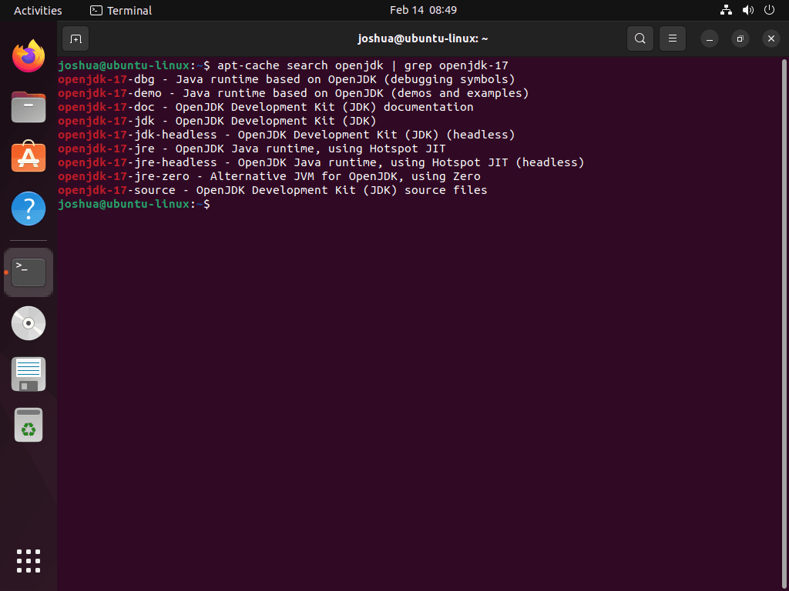
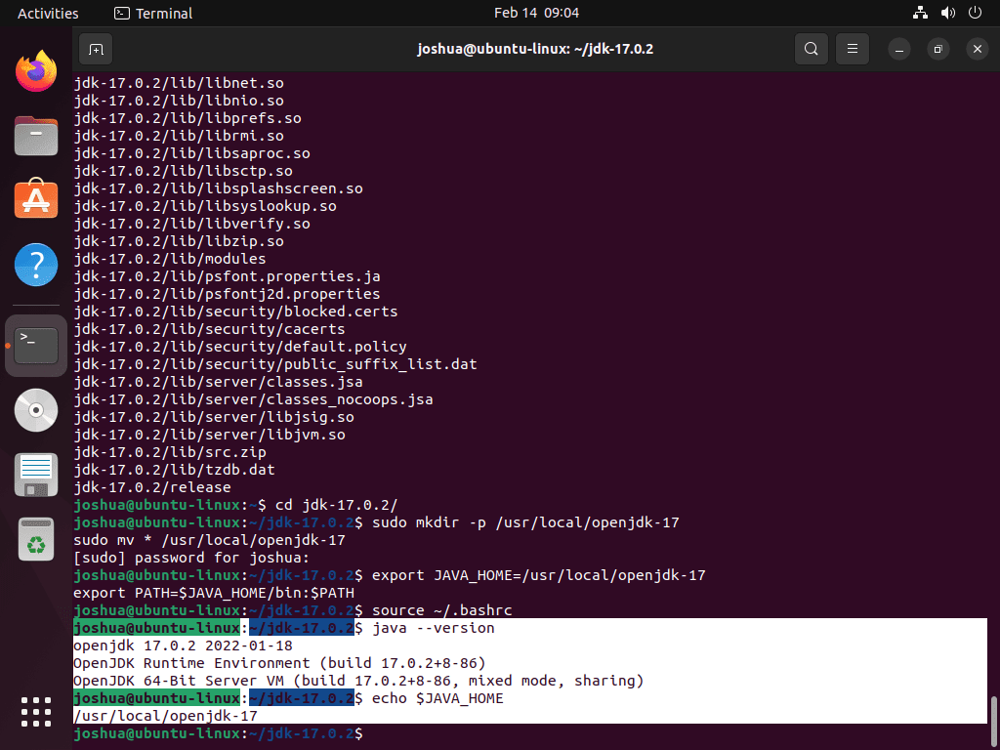
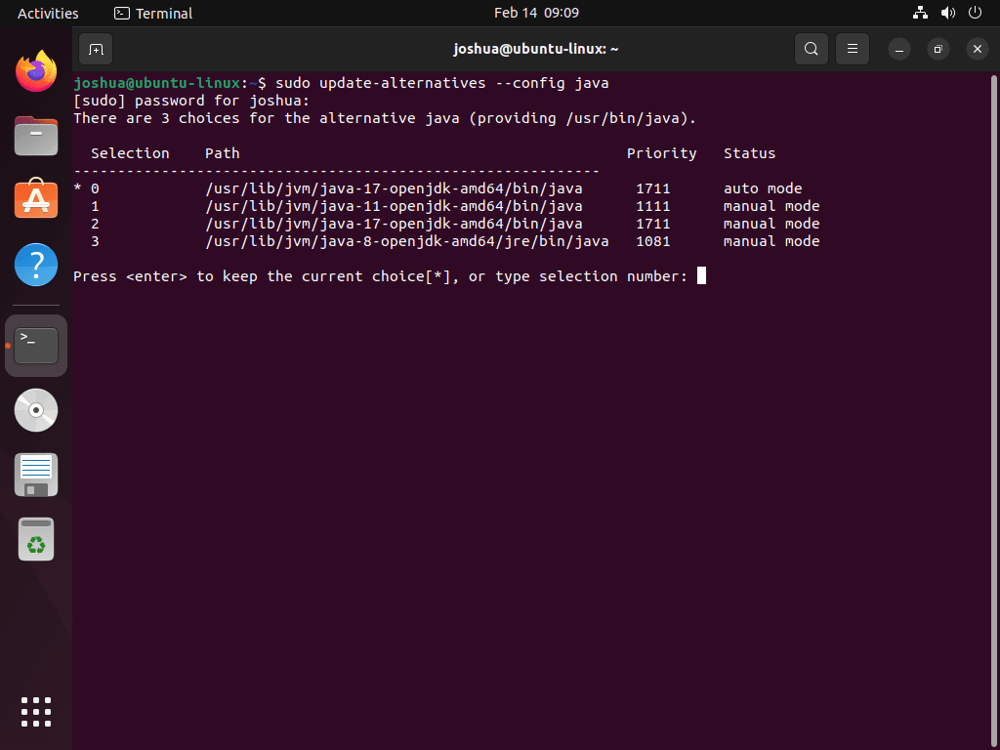
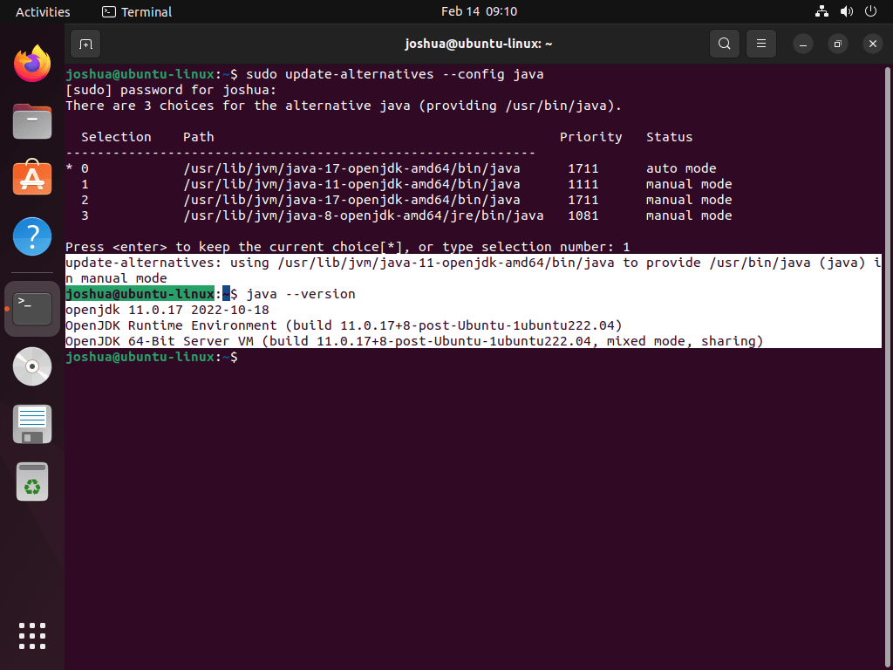

# Installing Oracle JRE or JDK 8 on Debian or Ubuntu Systems

Configure your system to use the latest version of [Oracle Java SE 8 JRE or JDK](http://www.oracle.com/technetwork/java/javase/downloads/index.html) (1.8u151minimum). Java 9 and later are not supported.

**Note:** After installing the JDK, you may need to set JAVA_HOME to your profile:

- For shell or bash: `export JAVA_HOME=path_to_java_home`
- For csh (C shell): `setenv JAVA_HOME=path_to_java_home`

1. Check which version of the JDK your system is using:

   ```bash
   java -version
   ```

   If the OpenJDK is used, the results should look like:

   ```
   openjdk version "1.8.0_242"
   OpenJDK Runtime Environment (build 1.8.0_242-b09)
   OpenJDK 64-Bit Server VM (build 25.242-b09, mixed mode)
   ```

   If Oracle Java is used, the results should look like:

   ```
   java version "1.8.0_241"
   Java(TM) SE Runtime Environment (build 1.8.0_241-b07)
   Java HotSpot(TM) 64-Bit Server VM (build 25.241-b07, mixed mode)
   ```

2. If necessary, go to [Oracle Java SE Downloads](https://www.oracle.com/technetwork/java/javase/downloads/index.html), accept the license agreement, and download the installer for your distribution.

   The Oracle JDK License has changed for releases starting April 16, 2019. See [Java SE Development Kit 8 Downloads](https://www.oracle.com/technetwork/java/javase/downloads/index.html).

   **Note:** If installing the Oracle JDK in a cloud environment, download the installer to your local client, and then use scp (secure copy) to transfer the file to your cloud machines.

   https://www.oracle.com/java/technologies/downloads/#java8

3. Make a directory for the JDK:

   ```bash
   sudo mkdir -p /usr/lib/jvm
   ```

4. Extract the tarball and install the JDK:

   ```bash
   sudo tar zxvf jdk-version-linux-x64.tar.gz -C /usr/lib/jvm
   ```

   The JDK files are installed into a directory called /usr/lib/jvm/jdk-8u_version.

5. Tell the system that there's a new Java version available:

   ```bash
   sudo update-alternatives --install "/usr/bin/java" "java" "/usr/lib/jvm/jdk1.8.0_version/bin/java" 1
   ```

   **Note:** If updating from a previous version that was removed manually, execute the above command twice, because you'll get an error message the first time.

6. Set the new JDK as the default:

   ```bash
   sudo update-alternatives --set java /usr/lib/jvm/jdk1.8.0_version/bin/java
   ```

7. Verify the version of the JRE or JDK:

   ```bash
   java -version
   ```

   ```
   java version "1.8.0_241"
   Java(TM) SE Runtime Environment (build 1.8.0_241-b07)
   Java HotSpot(TM) 64-Bit Server VM (build 25.241-b07, mixed mode)
   ```

## Manually install Oracle JDK 17 on Ubuntu 22.04|20.04|18.04

The official Oracle JDK is a development environment for building applications and components using the Java programming language. This toolkit includes tools for developing and testing programs written in the Java programming language and running on the Java platform.

We’ll [download Oracle JDK 17 ](https://www.oracle.com/java/technologies/javase/jdk17-archive-downloads.html)Debian installer

```
wget https://download.oracle.com/java/17/archive/jdk-17.0.3_linux-x64_bin.deb
```

Run the installer after it’s downloaded:


```
sudo apt install ./jdk-17.0.3_linux-x64_bin.deb
```

Additional dependencies should be installed automatically:

```
Reading package lists... Done
Building dependency tree
Reading state information... Done
Note, selecting 'jdk-17' instead of './jdk-17.0.3_linux-x64_bin.deb'
The following additional packages will be installed:
  libc6-i386 libc6-x32 libxtst6
The following NEW packages will be installed:
  jdk-17 libc6-i386 libc6-x32 libxtst6
0 upgraded, 4 newly installed, 0 to remove and 63 not upgraded.
Need to get 5517 kB/161 MB of archives.
After this operation, 346 MB of additional disk space will be used.
Do you want to continue? [Y/n] y
```

Set JAVA environment

```
echo 'export JAVA_HOME=/usr/lib/jvm/jdk-17/' | sudo tee -a /etc/profile
echo 'export PATH=$PATH:$JAVA_HOME/bin' | sudo tee -a /etc/profile
```

Source the file and confirm Java version:


```
$ source /etc/profile

$ echo $JAVA_HOME
/usr/lib/jvm/jdk-17/

$ java -version
java version "17.0.2" 2022-01-18 LTS
Java(TM) SE Runtime Environment (build 17.0.2+8-LTS-86)
Java HotSpot(TM) 64-Bit Server VM (build 17.0.2+8-LTS-86, mixed mode, sharing)
```

## Set Default Java Version on Ubuntu 22.04|20.04|18.04

Setting the default Java version applies in instances where you have multiple Java versions installed on your system.

First, you need to list all the available versions.

```
sudo update-alternatives --config java
```

Output:


```
There are 2 choices for the alternative java (providing /usr/bin/java).

  Selection    Path                                         Priority   Status
------------------------------------------------------------
* 0            /usr/lib/jvm/java-11-openjdk-amd64/bin/java   1111      auto mode
  1            /usr/lib/jvm/java-11-openjdk-amd64/bin/java   1111      manual mode
  2            /usr/lib/jvm/java-17-oracle/bin/java          1091      manual mode

Press <enter> to keep the current choice[*], or type selection number: 2
```

From the output, select the Java version you want to set as your default version by entering the number as shown above.

Verify the set version

```
$ java -version
java version "17.0.1" 2021-10-19 LTS
Java(TM) SE Runtime Environment (build 17.0.1+12-LTS-39)
Java HotSpot(TM) 64-Bit Server VM (build 17.0.1+12-LTS-39, mixed mode, sharing)
```

## Setting JAVA_HOME Environment Variable.

Setting the JAVA_HOME environment variable is important as it is used by Java applications to determine the install location of Java and the exact version to use when running the applications.


We will set a persistent path so we edit the file **/etc/profile** as below.

```
sudo vi /etc/profile
```

In the file, add the Java path as shown.

```
JAVA_HOME="/path/to/java/install"
```

In this case, my Java path will be.


```
JAVA_HOME="/usr/lib/jvm/java-17-oracle"
```

For these changes to apply, you require to log in and log out or use the source command.

```
source /etc/environment
```

Verify the set variables.

```
$ echo $JAVA_HOME
/usr/lib/jvm/java-17-oracle
```

## Test the Java Installation

We will now test the Java installation using a simple HTML file. In this guide, we will create an HTML file with the name **Hello_World.java**.


```
cat > Hello_World.java <<EOF
public class helloworld {
  public static void main(String[] args) {
    System.out.println("Hello Java World from Kenya! Java 17 is amazing!");
  }
}
EOF
```

Compile the code:

```
java Hello_World.java
```

Sample Output:

```
$ java Hello_World.java
Hello Java World from Kenya! Java 17 is amazing!
```

## Conclusion

Congratulations! You have triumphantly installed Java 17 (OpenJDK 17) on Ubuntu 22.04|20.04|18.04. In addition to that, you have learned how to configure Java alternatives and set the JAVA_HOME Environment Variable. I hope this was helpful


## openjdk安装

## Step 1: Update Ubuntu before OpenJDK 17 Installation on Ubuntu

Before installing OpenJDK, updating Ubuntu to ensure all system packages are current with the “apt update” command is essential. This helps to prevent any potential conflicts during the installation process. To update your Ubuntu system, run the following command in your terminal:

```bash
sudo apt update
sudo apt upgrade
```

## Step 2: Select OpenJDK Installation Method on Ubuntu

### Method 1: Install OpenJDK 17 with Ubuntu Repository

The first and most recommended method for installing OpenJDK is through the default Ubuntu repository. You can search for available packages using the “[grep](https://www.linuxcapable.com/grep-command-in-linux-with-examples/)” command. To do this, run the following command in your terminal:

```bash
apt-cache search openjdk | grep openjdk-17
```

*Example output:*

[Pin](https://www.linuxcapable.com/wp-content/uploads/2022/04/list-openjdk-packages-on-ubuntu-22.04-or-20.04-lts.png)Display of OpenJDK packages for Ubuntu 22.04 or 20.04 LTS.

Depending on your version of Ubuntu, you may be able to install OpenJDK 17 JDE and JRE using the following command. This is only applicable if these packages are available in your distribution:

```bash
sudo apt install openjdk-17-jre
sudo apt install openjdk-17-jdk
```

Confirm the installation by running the following command.

```bash
java --version
```

Updates are handled with the standard apt update and upgrade commands. However, you can remove them separately or altogether if you no longer require JDK or JRE.

```bash
sudo apt remove openjdk-17-jre openjdk-17-jdk --purge
```

Note that this will remove any unrequited leftover dependencies and thoroughly wipe the installation and data as much as possible from your system.

### Method 2: Install OpenJDK 17 Manual Method on Ubuntu

The second method for installing OpenJDK 17 is downloading the .tar.gz archive package. While this option is often more up-to-date than the version in the Ubuntu repository, it requires more manual maintenance, as you’ll need to keep an eye on new updates and repeat the installation process.

Visit the [downloads page](https://jdk.java.net/archive/) to obtain the latest build version link. Then, use the following [wget command](https://www.linuxcapable.com/wget-command-examples/) to download the package.

Here’s an example of downloading OpenJDK 17 version 17.0.2 for x64 (however, it is recommended to obtain a new link from the downloads page rather than copying this example):

```bash
wget https://download.java.net/java/GA/jdk17.0.2/dfd4a8d0985749f896bed50d7138ee7f/8/GPL/openjdk-17.0.2_linux-x64_bin.tar.gz
```

Once the download process is complete, extracting the archive is next.

```bash
tar -xvf openjdk-17.*
```

Next, navigate to the directory.

```bash
cd <directory_name>
```

Run the following command to install the OpenJDK 17 files.

```bash
sudo mkdir -p /usr/local/openjdk-17
sudo mv * /usr/local/openjdk-17
```

The next step is to set up the environment variables by adding the following lines to your .bashrc or .bash_profile file.

```bash
export JAVA_HOME=/usr/local/openjdk-17
export PATH=$JAVA_HOME/bin:$PATH
```

Source the .bashrc or .bash_profile file to apply the changes.

```bash
source ~/.bashrc
```

To verify that the installation was successful, run the following command.

```bash
java --version
echo $JAVA_HOME
```

If installed correctly, you should see the following output:

<iframe width="300px" height="250px" scrolling="no" marginwidth="0" marginheight="0" frameborder="0" title="advertisement" sandbox="allow-scripts allow-same-origin allow-popups allow-popups-to-escape-sandbox allow-top-navigation-by-user-activation allow-forms" style="box-sizing: inherit; margin: 0px auto; padding: 0px; border: none; max-width: 100%; width: 300px; display: block; height: 250px;"></iframe>


[Pin](https://www.linuxcapable.com/wp-content/uploads/2022/04/example-of-confirming-manual-installation-of-openjdk-17-on-ubuntu-22.04-or-20.04-lts.png)Verification of OpenJDK 17’s manual installation on Ubuntu 22.04 or 20.04 LTS.

As demonstrated, the version displayed is the latest OpenJDK 17 build.

## Step 3: Switching Alternative Java Versions on Ubuntu (Additional Commands)

After installing Java, you may want to check for newer versions and switch to them if necessary. To do this, use the following command to list the available alternatives:

```bash
sudo update-alternatives --config java
```

*Example output:*

[Pin](https://www.linuxcapable.com/wp-content/uploads/2022/04/example-of-openjdk-versions-print-out-in-terminal-when-switching-from-openjdk-17-on-ubuntu-22.04-or-20.04-lts.png)Verification of OpenJDK 17’s manual installation on Ubuntu 22.04 or 20.04 LTS.

The previous output shows that Java 11 is listed with “1”. To switch to this version, type the following and press the enter key, and you should see a similar printout:

```bash
update-alternatives: using /usr/lib/jvm/java-11-openjdk-amd64/bin/java to provide /usr/bin/java (java) in manual mode
```

Once the switch is complete, you can verify the default version using the following command.

```bash
java --version
```

*Example output:*

[Pin](https://www.linuxcapable.com/wp-content/uploads/2022/04/example-of-terminal-output-confirming-openjdk-is-now-switched-from-openjdk-17-on-ubuntu-22.04-or-20.04-lts.png)Visual representation of OpenJDK versions in the terminal during a transition from OpenJDK 17 on Ubuntu 22.04 or 20.04 LTS.

To switch to any other installed versions, repeat the same process.

## Conclusion: Installing OpenJDK 17 on Ubuntu Linux

In conclusion, installing OpenJDK 17 on Ubuntu is a straightforward process that can be accomplished through a few different methods. Whether you use the default Ubuntu repository, download the .tar.gz archive package, or switch to a different version, the steps outlined in this article will help you successfully install and manage OpenJDK 17 on your Ubuntu system.

Share This Post:

[Facebook](https://www.facebook.com/sharer/sharer.php?u=https%3A%2F%2Fwww.linuxcapable.com%2Fhow-to-install-openjdk-17-on-ubuntu-linux%2F%3Futm_source%3Dfacebook%26utm_medium%3Dsocial%26utm_campaign%3Dnovashare)[X](https://twitter.com/intent/tweet?text=How to Install OpenJDK 17 on Ubuntu 22.04 or 20.04&url=https%3A%2F%2Fwww.linuxcapable.com%2Fhow-to-install-openjdk-17-on-ubuntu-linux%2F%3Futm_source%3Dtwitter%26utm_medium%3Dsocial%26utm_campaign%3Dnovashare&via=LinuxCapable)[Reddit](https://www.reddit.com/submit?url=https%3A%2F%2Fwww.linuxcapable.com%2Fhow-to-install-openjdk-17-on-ubuntu-linux%2F%3Futm_source%3Dreddit%26utm_medium%3Dsocial%26utm_campaign%3Dnovashare&title=How to Install OpenJDK 17 on Ubuntu 22.04 or 20.04)[LinkedIn](https://www.linkedin.com/shareArticle?title=How to Install OpenJDK 17 on Ubuntu 22.04 or 20.04&url=https%3A%2F%2Fwww.linuxcapable.com%2Fhow-to-install-openjdk-17-on-ubuntu-linux%2F%3Futm_source%3Dlinkedin%26utm_medium%3Dsocial%26utm_campaign%3Dnovashare&mini=true)[Tumblr](https://www.tumblr.com/widgets/share/tool?canonicalUrl=https%3A%2F%2Fwww.linuxcapable.com%2Fhow-to-install-openjdk-17-on-ubuntu-linux%2F%3Futm_source%3Dtumblr%26utm_medium%3Dsocial%26utm_campaign%3Dnovashare)[Email](mailto:?subject=How to Install OpenJDK 17 on Ubuntu 22.04 or 20.04&body=https%3A%2F%2Fwww.linuxcapable.com%2Fhow-to-install-openjdk-17-on-ubuntu-linux%2F%3Futm_source%3Demail%26utm_medium%3Dsocial%26utm_campaign%3Dnovashare)[Telegram](https://telegram.me/share/url?url=https%3A%2F%2Fwww.linuxcapable.com%2Fhow-to-install-openjdk-17-on-ubuntu-linux%2F%3Futm_source%3Dtelegram%26utm_medium%3Dsocial%26utm_campaign%3Dnovashare&text=How to Install OpenJDK 17 on Ubuntu 22.04 or 20.04)[WhatsApp](https://api.whatsapp.com/send?text=How to Install OpenJDK 17 on Ubuntu 22.04 or 20.04+https%3A%2F%2Fwww.linuxcapable.com%2Fhow-to-install-openjdk-17-on-ubuntu-linux%2F%3Futm_source%3Dwhatsapp%26utm_medium%3Dsocial%26utm_campaign%3Dnovashare)[Pinterest](https://pinterest.com/pin/create/button/?url=https%3A%2F%2Fwww.linuxcapable.com%2Fhow-to-install-openjdk-17-on-ubuntu-linux%2F%3Futm_source%3Dpinterest%26utm_medium%3Dsocial%26utm_campaign%3Dnovashare&media=https://www.linuxcapable.com/wp-content/uploads/2022/04/How-to-Install-OpenJDK-17-on-Ubuntu-22.04-or-20.04.png&description=How to Install OpenJDK 17 on Ubuntu 22.04 or 20.04)[Hacker News](https://news.ycombinator.com/submitlink?u=https%3A%2F%2Fwww.linuxcapable.com%2Fhow-to-install-openjdk-17-on-ubuntu-linux%2F%3Futm_source%3Dhackernews%26utm_medium%3Dsocial%26utm_campaign%3Dnovashare&t=How to Install OpenJDK 17 on Ubuntu 22.04 or 20.04)[Share](https://www.linuxcapable.com/how-to-install-openjdk-17-on-ubuntu-linux/#)[Copy](https://www.linuxcapable.com/how-to-install-openjdk-17-on-ubuntu-linux/#)

### You May Also Like:

1. [How to Install OpenJDK 8 on Ubuntu 22.04 or 20.04](https://www.linuxcapable.com/how-to-install-openjdk-8-on-ubuntu-linux/)