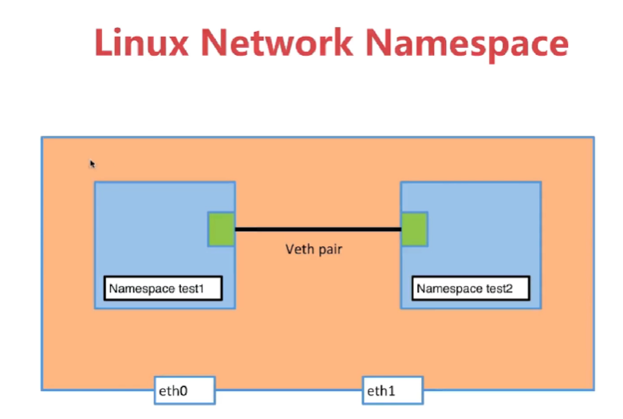

## 常用

```shell
shh  #连接远程服务器
pwd #查看所在目录位置
ifconfig #查看网络设备信息
free -h #检查内存
df -lh #查看硬盘空间
mkdir #新建目录
cd #转进目录
git #拉取项目代码
ls #查看文件
du -sh \* #查看占用空间
cat #查看项目介绍文件
uname -a #查看内核系统版本
查看方法：
1、用"uname －a"命令，可获取内核版本；
2、用"cat /proc/version"命令，可获取版本信息；
3、用"cat /etc/issue"或"cat
/etc/redhat-release  #命令，可获取发行版信息。
yum  #安装
which  #查看安装位置
wget  #下载
tar -cvf archive.tar file1 file2 directory/ #压缩
tar -zxvf \[文件名\]  #解压
\$ tar zxvf XXXX.tar.gz
\$ tar jxvf XXXX.tar.bz2
find -name \'\*.jar\*\' #查找
cp  #复制
nohup   #后台启动程序
jobs   #查看后台程序
ps -ef #查看进程
ps -ef \| grep \'java\' #只看有java的
netstat -ntlp #查看端口占用
curl 访问地址
tail -n 10 error.log #但看最新十行
sz 文件名 #下载到本地
kill -9 %1 #杀进程
chmod a+x filename #添加执行权限
nohup java -jar app.jar & #后台执行
crontab -e #定时任务
journalctl -u nginx.service #查看systemd服务日志, nginx为例
cat /etc/passwd //查看所有用户
chown -R www-data:www-data /home/project/xxxx.com   #修改目录拥有者


```

## 网络命名空间

- 网络命名空间实现的是网络隔离

  ```bash
  #查看网络命名空间
  sudo ip netns list
  #添加test网络命名空间
  sudo ip netns add test
  #进入网络命名空间执行命令 ip a
  sudo ip netns exec test ip a
  #显示系统中默认网络命名空间的网络接口和配置信息
  sudo ip link
  #显示系统中test网络命名空间的网络接口和配置信息
  sudo ip netns exec test ip link
  # 启动端口 (端口要up起来必须连接(插网线))
  sudo ip netns exec test ip link set dev lo up
  
  ```

- 创建两个veth接口, 加入到两上不通的网络命名空间,通过peer并使可以其联通,如图



  ``` bash
  #添加test1网络命名空间
  sudo ip netns add test1
  #添加test1网络命名空间
  sudo ip netns add test2
  #查看网络名空间,看是否添加成功
  sudo ip netns list
  #添加两个相连的网络接口veth-test1, veth-test2
  sudo ip link add veth-test1 type veth peer name veth-test2
  #查看当前接口装态
  sudo ip link
  #将veth-test1, veth-test2 设置入test1 test2命名空间
  sudo ip link set veth-test1  netns test1
  sudo ip link set veth-test2  netns test2
  #分配ip地址
  sudo ip netns exec test1 ip addr add 192.168.1.1/24 dev veth-test1
  sudo ip netns exec test2 ip addr add 192.168.1.2/24 dev veth-test2
  #此时veth-test1,veth-test12还是没有启用的状态, 所以需要启用
  sudo ip netns exec test1 ip link set dev veth-test1 up
  sudo ip netns exec test2 ip link set dev veth-test2 up
  #启用后才有ip地址,可用命令查看
  sudo ip netns exec test1 ip link
  sudo ip netns exec test2 ip link
  sudo ip netns exec test1 ip a
  sudo ip netns exec test2 ip a
  # 验证网络是否连通, 进入test1命名空间ping test2命名空间的地址
  sudo ip netns exec test1 ping 192.168.1.2
  # 同理
  sudo ip netns exec test2 ping 192.168.1.1
  ```

  
