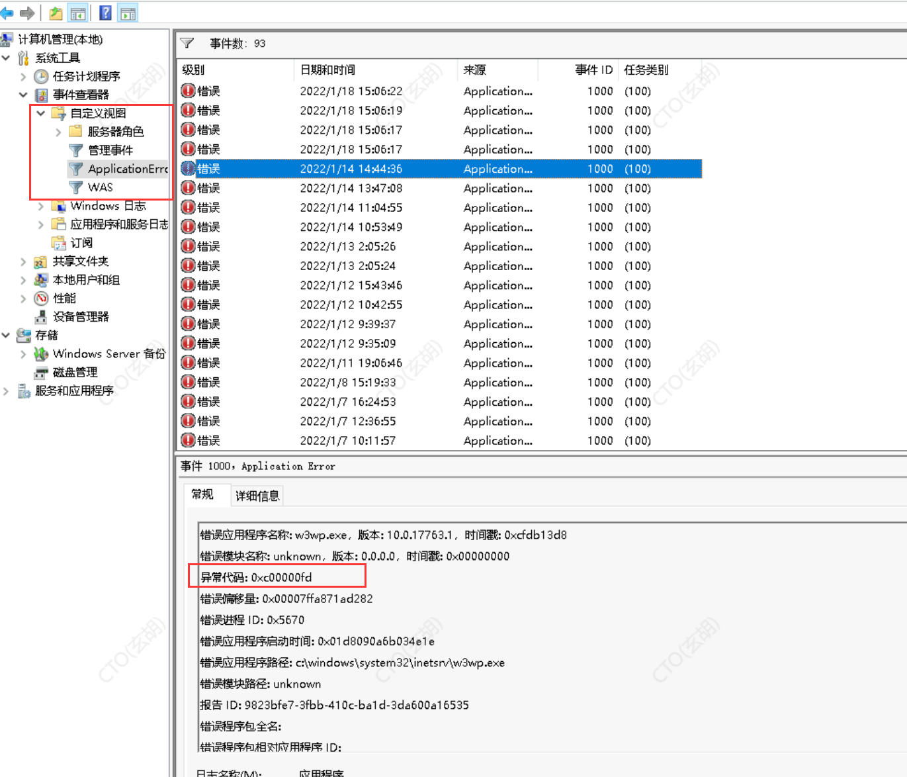
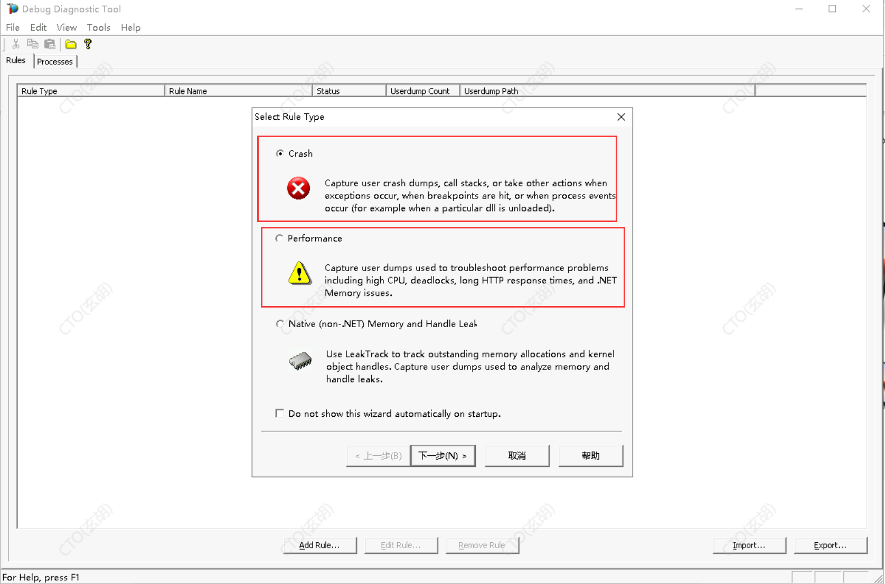

# [【彻底解决】为应用程序池“XXX”提供服务的进程在与 Windows Process Activation Service 通信时出现严重错误。该进程 ID 为“XXXX”。数据字段包含错误号。](https://www.cnblogs.com/qidian10/p/15825965.html)

之前写过一篇文章，https://www.cnblogs.com/qidian10/p/6028784.html 解释如何解决此类问题，但现在回过头来想一下，之前的文章还是太过浅显，无法完全有效的彻底解决此类问题。

近期因为工作原因，这个问题又凸显出来，这里做下解决思路，通过如下的解决思路基本可以应对任何此类这样的问题，能够快速准确的定位原因。

 

**一、事发背景**

谋SaaS架构产品，基于.net framework 跑在iis上，负载均衡3台web；

情况是每天的非固定时间会报一次cpu 100%的警告，部分情况下可在1分钟左右的时间自动恢复；访问量大的情况下持续很久需要人工干预；直观的表现如下：

1）cpu瞬间打满

2）iis请求队列排队严重

3）附加着带来若干redis请求异常，部分第三方api请求异常等

4）总之客户怨声载道，给系统打上“卡”的标签，投诉不断

 

 

 

 

 

 

二、分析问题

由于系统不是经常性的卡顿，是偶发性的，基本定性为几个方向：

**1、某一个不是特别常用的请求触发，或者某一个不是经常能够被操作的功能点，触发导致的；**

**2、redis请求堵塞导致：这个最先排除，因为卡顿的时候，其他负载组的并不卡；**

**3、最后一张图的直观反馈是session阻塞**

由于历史原因，系统保留了部分session的代码，根据资料显示，大并发情况下请求同一个session，利用session默认管理器的时候会导致请求排队。

https://stackoverflow.com/questions/16570855/requests-hanging-on-session-module-on-iis-7-5/27481000#27481000

https://blog.csdn.net/anyi2404/article/details/102251579

花了一个晚上时间，把系统里所有带session的引用全部重构掉，上线生产后，但是问题依旧

那么只有第一个可能了，按照这个思路排查这个期间发生的所有请求，按照每个请求的参数等情况去模拟，是可以复现问题的，但是这个工作量大的惊人，卡顿期间的url请求是几乎千条记录，靠人工是不现实的，另一主要原因是即使通过该方法解决了本问题，也不可以复制解决方案去应对未来的问题。所以这个方案放弃掉了。

 

三、开始抓dump分析

按照以往的惯例，每次卡顿的时候只需要在任务管理器进程-右键转存储，即可获取到dump文件，然后分析问题即可；但是该方式有个“坑”就是你抓取dump的时候不能存在应用程序池重启的情况，必须保证都是同一个应用程序池进程，否则的话你可能无法分析到真正的原因。

所以通过人工的方式抓取存在一定的运气性，常规类的一般都可以解决。但这次我们事后分析恰好踩了这次的坑，每次分析dump，几乎都是常规类的请求，代码复盘上基本不会有性能问题。

 

四、如何抓取到正确的dump包（工具一）

利用procdump：https://docs.microsoft.com/en-us/sysinternals/downloads/procdump 基本命令如下

procdump -ma -s 5 -n 2 -c 70 2160

定义：当-c 70 cpu超过70%的时候，连续超过-s 5秒的时候，抓取-n 2个dump，该操作绑定进程2160

利用工具抓取可以有效避免dump不准确的问题，执行上述命令后，服务器会自动开启监控任务，一单触发，自动打包dump文件

 

 

 

 

 

 

五、分析dump

之前写过一份简易版本的分析方案：http://www.cnunify.com/help/helpDetail?id=6abdffd4-c4c6-4310-ac02-32d62e7e62a7&title=%E7%9F%A5%E8%AF%86%E5%BA%93

更全面的可以参考园子大佬的：https://www.cnblogs.com/huangxincheng/category/1967355.html

 

毫无疑问大量的请求在等待被执行，正在队列中的还有283，足以让cpu高起来，那么接下来就看，到底是什么原因导致请求堵塞了。

经过不断的抓包分析，最终根据请求cpu占用时间排序靠前的线程，定位到一个方法BulkInsert（当然804个请求队列里面还有很多个其他类型的方法请求，需要专业，也需要运气）

 

 

 

之前没有特别注意这个方法，认为就是一个普通的批量插入，而且本地执行的时候也会很快，经过各种反复猜想后，最后突然想起一个问题：

因为EF自身的问题，批量插入、更新等效率太低，所以替换了一个第三方组件来支持：Z.EntityFramework.Extensions，这个组件有一个毛病，就是预热的时候会非常慢，必须等待预热完成才可以正常执行，预热期间的请求都会排队等待。

讲人话就是：第一次调用BulkInsert方法，会触发预热，会非常慢（看你实体模型数量），之后就正常毫秒级别了。

那么是什么原因会导致Z.EntityFramework.Extensions预热呢？

只有一个可能就是这个期间发生了应用程序池的重启，某些原因导致了异常，触发了重启。

恍然大悟，之前分析的时候就注意到was进程会崩溃，并报错“为应用程序池“XXX”提供服务的进程在与 Windows Process Activation Service 通信时出现严重错误。该进程 ID 为“XXXX”。数据字段包含错误号”

 

 

 

 

六、确认逻辑

到目前为止，基本定性了问题原因：某些请求，导致was（w3pw.exe）崩溃，进而应用程序池重启，重启触发了Z.EntityFramework.Extensions预热，预热过程带来了所有请求排队，访问量越高，阻塞越长，严重情况下服务器可能整体宕机！

 

七、究其根本，解决问题

两个方式：要么替换Z.EntityFramework.Extensions组件，但治标不治本；要么找到真正触发w3pw.exe崩溃和应用程序池重启的代码；很显然必须究其根本。

 

八、**如何抓取到正确的dump包（工具二）**

本块是文章重点，如何在异常情况下抓到最正确的dump包是分析问题的关键，上面介绍了一种抓dump方式，但是应对应用程序池崩溃问题，procdump工具并不奏效！

此处必须祭出大杀器：DebugDiaog2.0，实际只需要这一个工具即可。https://www.microsoft.com/en-us/download/details.aspx?id=49924

微软官方的参考demo：https://docs.microsoft.com/en-us/iis/troubleshoot/performance-issues/troubleshooting-high-cpu-in-an-iis-7x-application-pool

中文翻译版：https://cloud.tencent.com/developer/article/1619150?from=15425

基本按照文章的内容照做即可抓到正确的dump包。

DebugDiaog提供了当cpu、内存等资源异常时候自动监控和抓dump，也提供了当应用程序crash的时候自动抓dump。

 

按照对应操作步骤去创建规则rule即可

性能的抓包参考：https://docs.microsoft.com/en-us/iis/troubleshoot/performance-issues/troubleshooting-high-cpu-in-an-iis-7x-application-pool

crash抓包参考：https://stackoverflow.com/questions/18335678/how-to-debug-w3wp-clr-dll-error?noredirect=1

crash抓包的时候注意里面有个步骤需要选择类型，比如是栈溢出，还是其他异常，这个信息来自

 

 

九、现出原形**
**

利用第八步骤，抓到合适dump之后，即可正常分析问题了，也没必要用windbg分析了，直接用debugdiag自带的分析器，挂上去分析

 

结果：

 

至此罪魁祸首已经定位，找相关人员处理掉即可。

 

十、能学到点什么，总结精髓

1、dump是什么

2、如何抓取普通的dump，工具procdump

3、如何抓取特殊异常情况下最正确的dump，工具debugdiag，这是最重要的一步

4、如何分析dump内容，!t、!tp、.cordll -lp <path>、!runaway、!~[thread]s、!clrstack等等

5、Z.EntityFramework.Extensions的坑不得不重视
