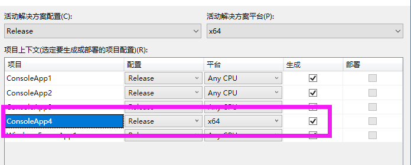
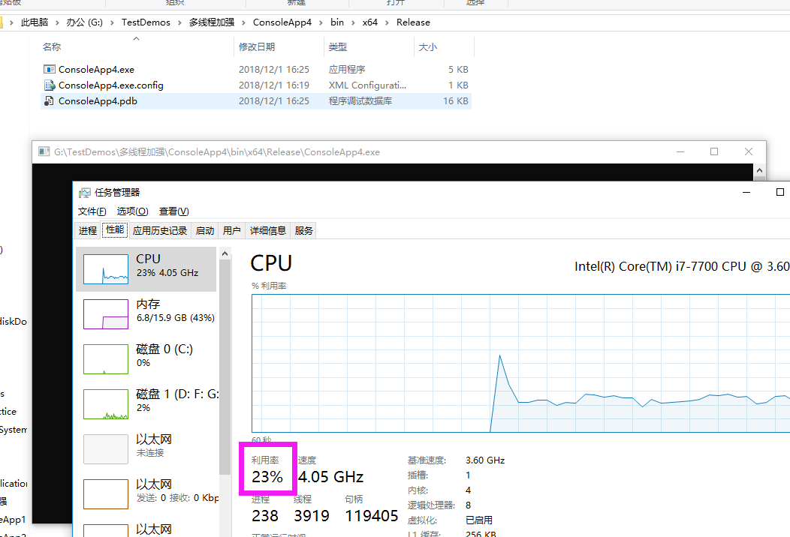
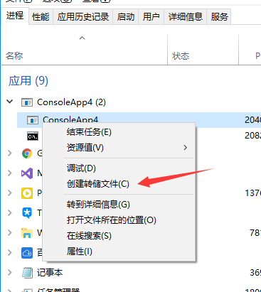
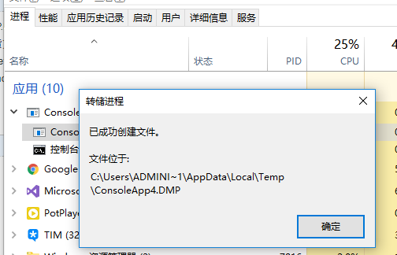
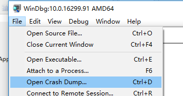
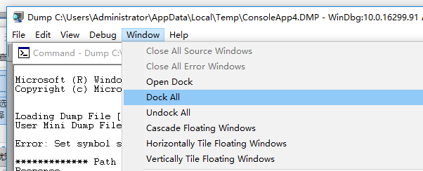
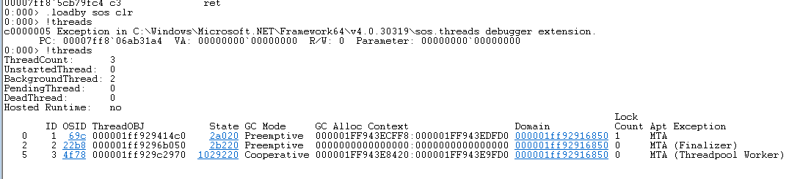
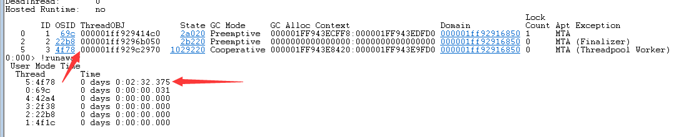
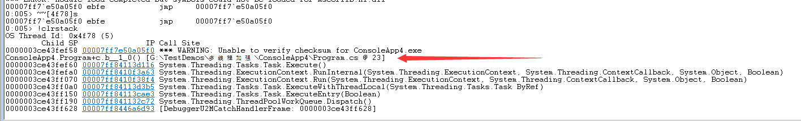
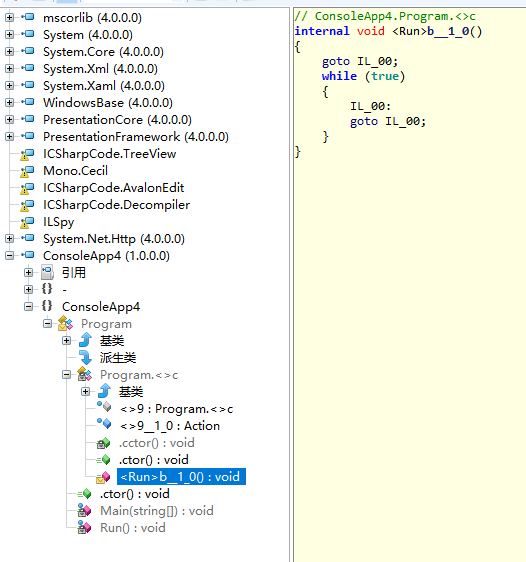

## CPU过高的问题

- 自动生成dump文件

  如果您希望在CPU占用高的情况下自动生成dump文件以便查找死循环或其他问题，您可以使用Windows自带的工具"procdump"。"procdump"是Sysinternals Suite的一部分，可以让您在特定条件下生成dump文件，如CPU占用率达到一定阈值时。

  以下是使用"procdump"工具进行设置的步骤：

  1. 下载"procdump"工具： 您可以从Microsoft官网下载Sysinternals Suite，其中包含了"procdump"工具。 下载地址：https://docs.microsoft.com/en-us/sysinternals/downloads/sysinternals-suite

  2. 将"procdump.exe"放置到一个易于访问的位置，例如"C:\procdump"。

  3. 使用命令行工具设置"procdump"： 打开命令提示符或PowerShell，并导航到"procdump"所在的文件夹。

  4. 使用以下命令来配置"procdump"，使其在CPU占用率达到指定阈值时自动生成dump文件：

     ```
     procdump -ma -c <CPU阈值> <进程ID或进程名>
     ```

     其中：

     - "-ma" 表示生成完整的内存转储。
     - "-c" 后面是CPU占用率的阈值，当进程的CPU占用率达到此阈值时，将生成dump文件。
     - "<进程ID或进程名>" 是您想要监控的进程的进程ID或进程名。

     例如，如果您想要监控IIS进程，并在CPU占用率达到80%时自动生成dump文件，可以使用以下命令：

     ```
     procdump -ma -c 80 w3wp.exe
     ```

  5. 程序运行时，"procdump"会在CPU占用率达到指定阈值时自动生成dump文件，并将其保存在当前目录下。

  请注意，"procdump"生成的dump文件可能会较大，因为它包含完整的内存转储。在CPU占用率高的情况下生成dump文件可能会对系统性能产生一定影响，因此请谨慎使用，并确保在需要时及时停止监控。另外，查找死循环可能需要更多的调试工作，您可能需要借助其他工具和技术来深入分析dump文件并找出问题的根本原因。

- 在使用"procdump"生成dump文件时，您可以通过添加"-n"参数来限制生成的文件数量。该参数指定了生成dump文件的最大数量，一旦达到设定的数量，"procdump"将不再生成新的dump文件，并且会自动覆盖最早生成的dump文件。

  以下是如何使用"-n"参数来限制文件生成的文件数量的示例：

  ```shell
  procdump -ma -c <CPU阈值> -n <最大文件数量> <进程ID或进程名>
  ```

  其中：

  - "-ma" 表示生成完整的内存转储。
  - "-c" 后面是CPU占用率的阈值，当进程的CPU占用率达到此阈值时，将生成dump文件。
  - "-n" 后面是要限制的最大文件数量。例如，设置为5表示最多生成5个dump文件。
  - "<进程ID或进程名>" 是您想要监控的进程的进程ID或进程名。

  例如，如果您希望在IIS进程的CPU占用率达到80%时自动生成dump文件，并限制最多生成5个dump文件，可以使用以下命令：

  ```shell
  procdump -ma -c 80 -n 5 w3wp.exe
  ```

  使用"-n"参数可以确保在生成dump文件时限制文件数量，以避免过多占用磁盘空间。一旦达到指定的最大文件数量，"procdump"将不再生成新的文件，并开始自动覆盖最早生成的dump文件，从而保持固定数量的文件。这样可以帮助您控制生成的dump文件数量，以便更好地管理和调试问题。


### 模拟CPU过高

示例代码：

[](javascript:void(0);)

```
class Program
{
    static void Main(string[] args)
    {
        Run();

        Console.Read();
    }

    static void Run()
    {
        var task = Task.Factory.StartNew(() =>
        {
            //这是一个非常复杂的逻辑，导致死循环
            while (true)
            {

            }
        });
    }
}
```

[](javascript:void(0);)

生成64位Realease版本代码：



在Bin/Realse下找到文件并运行，然后查看CPU：



### 解决CUP占用过高

创建转储文件：



**↓↓↓↓↓↓↓↓↓↓↓↓↓↓↓**



找到该转储文件：C:\Users\ADMINI~1\AppData\Local\Temp\ConsoleApp4.DMP

用X64版本的WinDbg打开DMP文件：



↓↓↓↓↓↓↓↓↓↓↓↓↓↓↓

然后打开命令输入：



然后输入 .loadby sos clr 与 !threads 



现在线程少没有关系，多的话我们没有办法去判断哪个线程消耗严重，所以执行 !runaway 查看当前托管线程已执行时间



切换到指定线程 ~~[4f78]s ，执行 !clrstack 查看当前线程的调用堆栈



从调用堆栈上来看，当前线程 在 Program+c.b__1_0() 方法之后23行就没有调用堆栈了，说明方法在这个地方停滞不前了。

最后反编译源码到指定的方法中去查看




## 二. 使用64位任务管理器转储的32位.NET进程dump, WinDbg如何调试?

在command输入栏输入 .load wow64exts 回车 !sw 回车，就将windbg的dump，从64位模式切换到了32位模式，否则看到的call stack 对我们分析dump是没有帮助的。然后就可以使用其它的命令来分析了。比如:使用kb命令，查看所有线程的调用堆栈，找出出错的线程，~*kb，就是查看所有线程的调用堆栈。

```
.load wow64exts 
!sw
~*kb
```


 收藏
文章标签： .net
版权
1 打开文件
因为实际是32位的进程，所以要使用32位的WinDbg(x86)来打开Dump文件，并设置好以下路径：

1.1 设置符号路径[Symbol File Path]（主要是pdb文件）

SRV*c:\localsymbols*http://msdl.microsoft.com/download/symbols;D:\MyProgram\Debug
1
SRVc:\localsymbolshttp://msdl.microsoft.com/download/symbols;
代表的是：从http://msdl.microsoft.com/download/symbols下载通用符号到到本地的c:\localsymbols后备用，是一些通用的pdb文件
后面的D:\MyProgram\Debug表示你代码的生成目录，也包含pdb文件

1.2 设置源代码路径[Source File Path]，也就你程序的源代码路径

D:\MyProgram
1
2 配置环境
1 加载 WOW64

将下载的soswow64.dll放到一个文件夹下，比如C:\DLL\soswow64.dll

使用命令加载此dll

 0:000> .load C:\DLL\soswow64.dll
1
它的主要目的是用来创建32-bit环境, 为了让32位的应用程序可以不经过任何修改就运行在64-bit的系统上.

下载 soswow64.dll

2 使用命令**!wow64exts.sw**切换到x86模式下

0:000> !wow64exts.sw
1
Switched to Guest (WoW) mode

3 加载SOS
0:000> .load C:\Windows\Microsoft.NET\Framework\v4.0.30319\SOS.dll
1
以下命令可以正常执行没有报错，则代表sos扩展已经加载成功

0:000> .loadby sos clr
1
三、根据需求使用相应命令进行分析
比如：要分析当前线程的托管堆栈（managed stack）
0:000> !clrstack
————————————————
版权声明：本文为CSDN博主「Liu_yang_ji」的原创文章，遵循CC 4.0 BY-SA版权协议，转载请附上原文出处链接及本声明。
原文链接：https://blog.csdn.net/qq_32721543/article/details/132008504

## 三 常用命令

``` 

.load <path>     #加载扩展
.unload <path>   #卸载扩展
.unload all 	 #卸载所有扩展
.chain			 #命令以默认搜索顺序显示所有加载的调试器扩展模块。
.load wow64exts  #64 32位切换
!sw				 #64 32位切换
```

