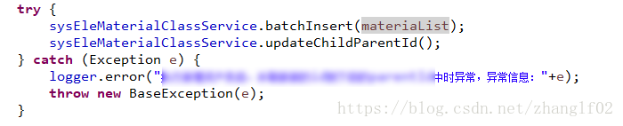
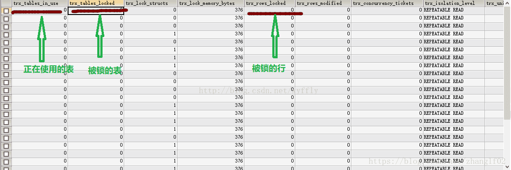

# mysql 常用

## 一. 备份还原

- 普通备份还原

```bash
#备份
/usr/bin/mysqldump -h localhost -P3306 -uroot -p<密码> <数据库名> > <保存文件路径>
#还原
mysql -uroot -p --default-character-set=utf8mb4 db_name < db_name.sql
```

- 使用**binlog**进行数据恢复

``` shell
mysqldump -uroot -p --master-data=2 --single-transaction -A > /tmp/all.sql
```

当使用MySQL的`mysqldump`工具进行备份时，`--master-data`选项用于在导出的备份文件中包含二进制日志坐标，这对于进行按时间点的恢复或设置复制很有用。

`--master-data`选项可以采用不同的值来控制输出中包含的信息级别。在这种情况下，`--master-data=2`表示二进制日志坐标将作为注释写入备份文件中。二进制日志坐标包含了备份时二进制日志文件的名称和文件内的位置。

当你希望使用备份文件中包含的二进制日志坐标来执行按时间点的恢复时，通常会使用`--master-data=2`选项。这个信息能够帮助你确定备份时的二进制日志的确切位置，从而可以通过复制或手动应用二进制日志将数据库恢复到特定的时间点。

例如，当你执行以下命令时：

```shell
mysqldump -uroot -p --master-data=2 --single-transaction -A > /tmp/all.sql
```

将会生成一个名为`/tmp/all.sql`的备份文件，其中包含了重新创建所有数据库的SQL语句(`-A`选项)，同时在文件中作为注释包含了二进制日志坐标(`--master-data=2`)。

- 从binlog 

  ```
   mysqlbinlog /tmp/mysql-bin.000005 --start-position=1673097--stop-position=1673374-vv > /tmp/mysql.binlog
  ```

  

## 附: 常见错误

1.  com.mysql.cj.exceptions.CJException: null,  message from server: "Host 'xxxx' is blocked because of many connection errors; unblock with 'mysqladmin flush-hosts'"

首先数据库使用Navicat访问正常，但是应用访问就是不行，即使重启mysql实例也没效果。最后定位到，应该是短时间内产生了大量中断的数据库连接导致，而且失败的连接数量超过了mysql的max_connection_errors的最大值。

1.登录mysql，使用 flush hosts来命令清理hosts文件

flush hosts;

2.调整mysql的最大连接数和最大错误连接数的大小

查看mysql最大错误连接数

show variables like '%max_connect_errors%'

查看mysql最大连接数：

show variables like 'max_connections';

修改连接数大小：

set global max_connections = 1000;
set global max_connect_errors = 1000;

## 事务没提交导致死锁问题

**事务操作时中断导致锁表**

1.导致锁表的原因
1.1首先是大前提
我们正常的框架在service层都会有事物控制，比如我一个service层的方法要执行更新两张表，这两个表只有同时更新成功才算成功，如果有一个异常，事务回滚。



1.2 我的操作

这是源代码的部分，当debug到sysEleMaterialClassService.updateChildParentId();出现异常，然后在catch里我打了个断点，看报错信息。看完之后没有走到 throw这个抛异常的方法，然后我就关闭了应用，修改代码。等重启后就发现表锁了。
我这个操作就导致即没有抛异常让事务回滚，也没有让mybatis提交事务，但是表这是已经被锁定，等着你提交后执行，就这么一直等着，始终没有提交。 mybatis 对 jdbc 的代码做过封装，它的事务提交时手动的，所以我们每次要sqlSession.submit();而这一步应该是走完方法到controller层后才提交。我这里到service层就停了。

1.3 报错信息

再次启动程序还是能够查询，但是对update ,insert的操作已经执行报错： Lock wait timeout exceeded; try restarting transaction

2.解决锁表问题
2.1 先用这条命令查询数据库阻塞的进程

```
SELECT * FROM information_schema.innodb_trx
```

得到的数据如下：


2.2
主要看箭头指向的这几个字段，如果有阻塞数据（不为0的就是阻塞的）,找到后在根据下图这个字段：try_mysql_thread_id 作为这条数据的主键id执行这个sql进行删除： kill id ;(杀死对应id的进程).假设这里try_mysql_thread_id=277 的这条数据是锁了。我们执行 kill 277 删除就不在锁表了。
